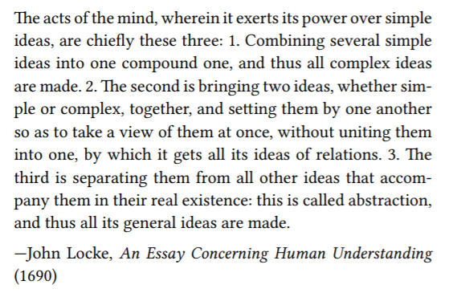
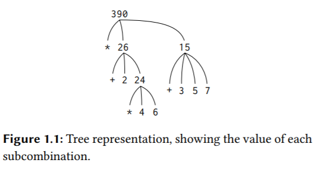
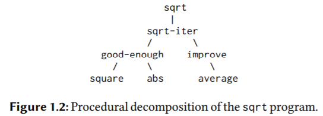

# 1 Building Abstractions with Procedures



## 1.1 The Elements of Programming

**Every powerful language has three mechanisms for accomplishing this:**

- **primitive expressions, which represent the simplest entities the language is concerned with,**
- **means of combination, by which compound elements are built from simpler ones, and**
- **means of abstraction, by which compound elements can be named and manipulated as units.**

**In programming, we deal with two kinds of elements: procedures and data. (Later we will discover that they are really not so distinct.) Informally, data is “stuff ” that we want to manipulate, and procedures are descriptions of the rules for manipulating the data. Thus, any powerful programming language should be able to describe primitive data and primitive procedures and should have methods for combining and abstracting procedures and data.**

### 1.1.1 Expressions

1. **primitive expression.**
2. **compound expression.**

One kind of primitive expression you might type is a number.

```sche
486
486
```

Expressions representing numbers may be combined with an expression representing a primitive procedure (such as + or *)（也可以是自定义的procedure） to form a compound expression that represents the application of the procedure to those numbers.

```scheme
(+ 2.7 10)
12.7
```

### 1.1.2 Naming and the Environment

A critical aspect of a programming language is the means it provides for using names to **refer to computational objects**（可以是primitive expression也可以是compound expression，也就是所谓的数据和指令序列，进一步概括起来就是bit序列）. We say that the name identifies a variable whose value is the object.

```scheme
(define size 2)
```

causes the interpreter to associate the value 2 with the name size. Once the name size has been associated with the number 2, we can refer to the value 2 by name:

```sche
size
2
```

```scheme
(define pi 3.14159)
(define radius 10)
(* pi (* radius radius))
314.159
(define circumference (* 2 pi radius))
circumference
62.8318
```

**It should be clear that the possibility of associating values with symbols and later retrieving them means that the interpreter must maintain some sort of memory that keeps track of the name-object pairs. This memory is called the environment（键值对的集合，符号->对象）** (more precisely the global environment, since we will see later that a computation may involve a number of different environments).

### 1.1.3 Evaluating Combinations

To evaluate a combination, do the following:
1. Evaluate the subexpressions of the combination.
2. Apply the procedure that is the value of the leftmost subexpression (the operator) to the arguments that are the values of the
other subexpressions (the operands).

First, observe that the first step dictates that in order to accomplish the evaluation process for a combination we must first perform the evaluation process on each element of the combination. Thus, the evaluation rule is recursive in nature; that is, it includes, as one of its steps, the need to invoke the rule itself.

```scheme
(* (+ 2 (* 4 6))
   (+ 3 5 7))
```



**In general, we shall see that recursion is a very powerful technique for dealing with hierarchical, treelike objects.**

Next, observe that the repeated application of the first step brings us to the point where we need to evaluate, not combinations, but primitive expressions such as numerals, built-in operators, or other names. We take care of the primitive cases by stipulating that

- **the values of numerals are the numbers that they name,**
- **the values of built-in operators are the machine instruction sequences that carry out the corresponding operations, and**
- **the values of other names are the objects associated with those names in the environment.**

We may regard the second rule as a special case of the third one by stipulating that symbols such as + and * are also included in the global environment, and are associated with the sequences of machine instructions that are their “values.”

**The key point to notice is the role of the environment in determining the meaning of the symbols in expressions.** In an
interactive language such as Lisp, it is meaningless to speak of the value of an expression such as (+ x 1) without specifying any information about the environment that would provide a meaning for the symbol x (or even for the symbol +). As we shall see in Chapter 3, the general notion of the environment as providing a context in which evaluation takes place will play an important role in our understanding of program execution.

Notice that the evaluation rule given above does not handle definitions. For instance, evaluating (define x 3) does not apply define to two arguments, one of which is the value of the symbol x and the other of which is 3, since the purpose of the define is precisely to associate x with a value. (That is, (define x 3) is not a combination.)

Such exceptions to the general evaluation rule are called special forms. Each special form has its own evaluation rule.

In comparison with most other programming languages, **Lisp has a very simple syntax; that is, the evaluation rule for expressions can be described by a simple general rule together with specialized rules for a small number of special forms.**


### 1.1.4 Compound Procedures

除了primitive procedures，如+, /, <, =, and, not，我们还可以自定义procedure。

The general form of a procedure definition is

```scheme
(define (<name> <formal parameters>)
	<body>)
```

区别于name definition，

```scheme
(define <name> <expression>)
```

### 1.1.5 The Substitution Model for Procedure Application

- **normal-order evaluation: “fully expand and then reduce”.**
- **applicative-order evaluation: “evaluate the arguments and then apply”.**

```scheme
(sum-of-squares (+ 5 1) (* 5 2))
(+ (square (+ 5 1)) (square (* 5 2)) )
(+ (* (+ 5 1) (+ 5 1)) (* (* 5 2) (* 5 2)))
(+ (* 6 6) (* 10 10))
(+ 36 100)
136
```

Lisp uses applicative-order evaluation, partly because of the additional efficiency obtained from avoiding multiple evaluations of expressions such as those illustrated with (+ 5 1) and (* 5 2) above and, more significantly, because normal-order evaluation becomes much more complicated to deal with when we leave the realm（领域） of procedures that can be modeled by substitution. On the other hand, normal-order evaluation can be an extremely valuable tool, and we will investigate some of its implications in Chapter 3 and Chapter 4.

### 1.1.6 Conditional Expressions and Predicates

下面是几个special forms。

```scheme
#lang sicp

(define (abs1 x)
  (cond ((< x 0) (- x))
        ((> x 0) x)
        ((= x 0) 0)))

(define (abs2 x)
  (cond ((< x 0) (- x))
        (else x)))

(define (abs3 x)
  (if (< x 0)
      (- x)
      x))

(abs3 -3)
(abs3 4)

(define (>= x y) (or (> x y) (= x y))

(define (>= x y) (not (< x y)))
```

Notice that and and or are special forms, not procedures, because the subexpressions are not necessarily all evaluated. not is an ordinary procedure.（**短路求值**）

> Exercise 1.3: Define a procedure that takes three numbers as arguments and returns the sum of the squares of the two larger numbers.

```scheme
(define (square x) (* x x))
(define (sum_square a b)
  (+ (square a)
     (square b)))
(define (>= a b) (not (< a b)))
(define (larger_two_sum_square a b c)
  (cond ((and (>= a c) (>= b c)) (sum_square a b))
        ((and (>= a b) (>= c b)) (sum_square a c))
        (else (sum_square b c))))

(larger_two_sum_square 1 2 3) ; 13
(larger_two_sum_square 1 1 1) ; 2
(larger_two_sum_square 1 2 2) ; 8
(larger_two_sum_square 1 1 2) ; 5
```

> Exercise 1.4: Observe that our model of evaluation allows for combinations whose operators are compound expressions. Use this observation to describe the behavior of the following procedure:
>
> ```scheme
> (define (a-plus-abs-b a b)
>   ((if (> b 0) + -) a b))
> ```

a + |b|.

> Exercise 1.5: Ben Bitdiddle has invented a test to determine whether the interpreter he is faced with is using applicativeorder evaluation or normal-order evaluation. He defines the following two procedures:
>
> ```scheme
> (define (p) (p))
> (define (test x y)
>   (if (= x 0) 0 y))
> ```
>
> Then he evaluates the expression
>
> ```scheme
> (test 0 (p))
> ```
>
> What behavior will Ben observe with an interpreter that uses applicative-order evaluation? What behavior will he observe with an interpreter that uses normal-order evaluation? Explain your answer.

如果是正则序，会无尽地展开：

```scheme
(test 0 (p))
(test 0 (p))
(test 0 (p))
```

如果是应用序，会先求值实参：

```scheme
(test 0 (p))
(if (= 0 0) 0 (p))
(if #t 0 (p))
0
```

### 1.1.7 Example: Square Roots by Newton’s Method

```scheme
(define (square x)
  (* x x))
(define (average x y)
  (/ (+ x y) 2))
(define (improve guess x)
  (average (/ x guess) guess))
(define (good-enough? guess x)
  (< (abs (- (square guess) x)) 0.001))
(define (sqrt-iter guess x)
  (if (good-enough? guess x)
      guess
      (sqrt-iter (improve guess x) x)))

(define (sqrt x)
  (sqrt-iter 1.0 x)) ; 注意这里要传递1.0而不是1，这样才会将结果显式为小数而不是分数。

(sqrt 9)
(sqrt 2)
(square (sqrt 1000))
```

> Exercise 1.6: Alyssa P. Hacker doesn’t see why if needs to be provided as a special form. “Why can’t I just define it as an ordinary procedure in terms of cond?” she asks. Alyssa’s friend Eva Lu Ator claims this can indeed be done, and she defines a new version of if:
>
> ```scheme
> (define (new-if predicate then-clause else-clause)
>   (cond (predicate then-clause)
>         (else else-clause)))
> ```
>
> Eva demonstrates the program for Alyssa:
>
> ```scheme
> (new-if (= 2 3) 0 5)
> 5
> (new-if (= 1 1) 0 5)
> 0
> ```
>
> Delighted, Alyssa uses new-if to rewrite the square-root program:
>
> ```scheme
> (define (sqrt-iter guess x)
>   (new-if (good-enough? guess x)
>           guess
>           (sqrt-iter (improve guess x) x)))
> ```
>
> What happens when Alyssa attempts to use this to compute square roots? Explain.

按照应用序求值规则，会先求值实参，而new-if会求值所有的子句，而不是像内置的if那样根据断言只求值其中的一个子句，所以会无限递归。

> Exercise 1.7: The good-enough? test used in computing square roots will not be very effective for finding the square roots of very small numbers. Also, in real computers, arithmetic operations are almost always performed with limited precision. This makes our test inadequate for very large numbers. Explain these statements, with examples showing how the test fails for small and large numbers. An alternative strategy for implementing good-enough? is to watch how guess changes from one iteration to the next and to stop when the change is a very small fraction of the guess. Design a square-root procedure that uses this kind of end test. Does this work better for small and large numbers?

0.001的绝对容错，对于比较小的数，太大：

```scheme
(sqrt 0.0001) ; 0.03230844833048122
```

对于比较大的被开方数(radicand)，用浮点数存储时，留给小数部分的位数很少，导致两数相减总是会大于0.001。

```scheme
(sqrt 1000000000000) ; 1000000.0
(sqrt 10000000000000) ; endless loop
; The algorithm gets stuck because (improve guess x) keeps on yielding 4472135.954999579 but (good-enough? guess x) keeps returning #f.
```

```scheme
;; Modified version to look at difference between iterations 
(define (good-enough? guess x) 
 (< (abs (- (improve guess x) guess)) 
    (* guess .001)))
```

> [random person]: I don't see why (* guess 0.001) is used. Just '0.001' or whatever tolerance desired seems to work fine. It would be nice if someone explained above if there is a reason why the (* guess 0.001) is better.
>
> [SchemeNewb]: Just using 0.001 is, in effect, doing the same thing as the original program. It basically says "If the difference between this guess and improved guess is less than 0.0001 in absolute terms (as opposed to percent terms) then stop improving." Problem with this is the same as explained up top. For really tiny numbers, it is easy for the total difference between guess and improve guess to be less than .0001 and for the program to stop without actually doing anything. For large numbers, it might take forever to get to where guess and improved guess are less than .0001. So the book asks us to stop the program if improved guess is less than a certain PERCENT of guess. And THAT is what this alternative does. It checks to see how close guess and improved guess are as a percent. It basically says: "figure out how far guess is from improved guess and then see if that amount is less than .1% of guess. If it is, stop the program"

### 1.1.8 Procedures as Black-Box Abstractions



The importance of this decomposition strategy is not simply that one is dividing the program into parts. After all, we could take any large program and divide it into parts—the first ten lines, the next ten lines, the next ten lines, and so on. Rather, it is crucial that each procedure accomplishes an identifiable task that can be used as a module in defining other procedures.

过程作为黑箱抽象，一个过程定义应该能隐藏起一些细节，这将使过程的使用者可能不必自己去实现这些过程， 而是从其它程序员那里作为一个黑箱而接受了它。用户在使用一个过程时，应该不需要去弄清楚它是如何实现的。

过程要作为黑箱，过程的形式参数必须是约束变量，如果不是，该过程就会依赖于用户的环境（符号冲突和覆盖），不方便用户使用。

```scheme
(define (sqrt x)
  (define (improve guess)
    (/ (+ guess (/ x guess)) 2))
  (define (good_enough? guess)
    (<= (abs (- (improve guess) guess))
     (* guess .0001)))
  (define (sqrt_iter guess)
    (if (good_enough? guess)
      guess
      (sqrt_iter (improve guess))))
  (sqrt_iter 1.0))
```

上面的x是sqrt的约束变量，是sqrt中定义的过程的自由变量。

### 角料

1. Prefix notation has several advantages, however. One of them is that it can accommodate procedures that may take an arbitrary number of arguments, as in the following examples:

   ```scheme
   (+ 21 35 12 7)
   75
   ; 其实真正的前缀记法应该是(+++ 21 35 12 7)，但因为对每两个操作数应用的都是同一个操作，所以省略了。如果用中缀记法，我们就必须把所有操作符都写出来，即使这些操作符都相同。后缀记法可以达到前缀记法相同的效果，不过scheme选择了前缀记法。
   ```

   A second advantage of prefix notation is that it extends in a straightforward way to allow combinations to be nested, that is, to have combinations whose elements are themselves combinations:

   ```scheme
   (+ (* 3 5) (- 10 6))
   19
   ; 第二点其实是建立在第一点的基础上的。
   ```

2. Even with complex expressions, the interpreter always operates in the same basic cycle: It reads an expression from the terminal, evaluates the expression, and prints the result. This mode of operation is ofen expressed by saying that the interpreter runs in a **read-eval-print loop**. Observe in particular that it is not necessary to explicitly instruct the interpreter to print the value of the expression.

3. Special syntactic forms that are simply convenient alternative surface structures for things that can be writen in more uniform ways are sometimes called **syntactic sugar**, to use a phrase coined by Peter Landin. 

