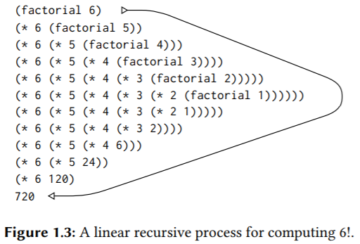
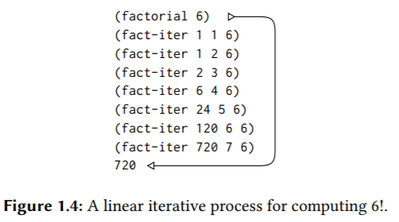
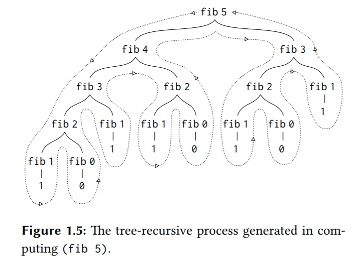

## 1.2 Procedures and the Processes They Generate

**To become experts, we must learn to visualize the processes generated by various types of procedures. Only after we have developed such a skill can we learn to reliably construct programs that exhibit the desired behavior.**

In this section we will examine some common “**shapes**” for processes generated by simple procedures.

**静态的procedure，动态的process。**

### 1.2.1 Linear Recursion and Iteration

```scheme
(define (factorial n)
  (if (= n 1)
      1
      (* n (factorial (- n 1)))))

(define (factorial n)
  (fact-iter 1 1 n))
(define (fact-iter product counter max-count) ; counter是循环变量。
  (if (> counter max-count)
      product
      (fact-iter (* counter product) ; 尾递归。
                 (+ counter 1)
                 max-count)))
```

使用应用序的替代模型进行求值：





**When we describe a procedure as recursive, we are referring to the syntactic fact that the procedure definition refers (either directly or indirectly) to the procedure itself. But when we describe a process as following a pattern that is, say, linearly recursive, we are speaking about how the process evolves, not about the syntax of how a procedure is written.** 

### 1.2.2 Tree Recursion

```scheme
(define (fib n)
  (cond ((= n 0) 0)
        ((= n 1) 1)
        (else (+ (fib (- n 1))
                 (fib (- n 2))))))

(define (fib n)
  (fib-iter 1 0 n))
(define (fib-iter a b count)
  (if (= count 0)
      b
      (fib-iter (+ a b) a (- count 1))))
```



#### Example: Counting change

```scheme
(define (count-change amount) (cc amount 5))
(define (cc amount kinds-of-coins)
  (cond ((= amount 0) 1)
        ((or (< amount 0) (= kinds-of-coins 0)) 0) ; 第一个条件表示零钱兑换溢出了，这是一种不合法的兑换方式，所以返回0。
        (else (+ (cc amount (- kinds-of-coins 1)) ; 不使用当前硬币。
                 (cc (- amount (first-denomination kinds-of-coins)) kinds-of-coins))))) ; 使用当前硬币A，注意进入下一次调用后，也会有两个分支，一个不再使用硬币A，一个继续使用硬币A。

(define (first-denomination kinds-of-coins) ; 一个数组或哈希表。
  (cond ((= kinds-of-coins 1) 1)
      ((= kinds-of-coins 2) 5)
      ((= kinds-of-coins 3) 10)
      ((= kinds-of-coins 4) 25)
      ((= kinds-of-coins 5) 50)))

(count-change 100)
```

> Exercise 1.11: Write a procedure that computes f by means of a recursive process. Write a procedure that computes f by means of an iterative process.

```scheme
(define (f n)
  (if (< n 3)
      n
      (+ (f (- n 1)) (* 2 (f (- n 2))) (* 3 (f (- n 3))))))

(f 5)

; 从f(n)=f(n-1)+2*f(n-2)+3*f(n-3)可看出，当前状态依赖之前三个状态，所以需要三个变量存储三个连续的状态，外加一个循环变量。
(define (f1 n)
  (define (f-iter a b c n)
    (cond ((= n 0) a)
          ((= n 1) b)
          ((= n 2) c)
          (else (f-iter b c (+ c (* 2 b) (* 3 a)) (- n 1)))))
  (f-iter 0 1 2 n))

(f1 5)
```

> Exercise 1.12: Write a procedure that computes elements of Pascal’s triangle by means of a recursive process.

```scheme
; 行号和列号都从1开始，这样可以拥有性质：第n行有n列。
(define (ptcell r c)
  (if (or (= c 1) (= r c))
      1
      (+ (ptcell (- r 1) (- c 1))
         (ptcell (- r 1) c))))

;; Testing 
(ptcell 1 1) 
(ptcell 2 2) 
(ptcell 3 2) 
(ptcell 4 2) 
(ptcell 5 2) 
(ptcell 5 3)

; TODO：实现打印杨辉三角的程序。
```

### 1.2.3 Orders of Growth

### 1.2.4 Exponentiation

```scheme
; 快递幂。
; b^n = (b^(n/2))^2, if n is even,
; b^n = (b*b^(n-1)), if n is odd.
; 时间复杂度O(logn).
; 迭代过程的实现可参考算法笔记4.5节。
; 该算法无法处理指数为负数的情况。
(define (fast-exp b n)
  (define (square x) (* x x))
  (define (even? x) (= (remainder x 2) 0))
  (cond ((= n 0) 1)
        ((even? n) (square (fast-exp b (/ n 2))))
        (else (* b (fast-exp b (- n 1))))))

(fast-exp -2 8)
```

> Exercise 1.16: 

```scheme
; n/2相当于二进制右移一位。若n是奇数，那么减一会将二进制最低位置0。
; (b^(n/2))^2 = (b^2)^(n/2)，这样就可以把递归过程转换为迭代过程了。
; 迭代过程保持一个不变量，即a*(b^n)，对n的削减，会将效果转移到a或b上去。
; In general, the technique of defining an invariant quantity that remains unchanged from state to state is a powerful way to think about the design of iterative algorithms.
(define (fast-exp b n)
  (define (iter a b n)
    (cond ((= n 0) a)
          ((even? n) (iter a (square b) (/ n 2)))
          (else (iter (* a b) b (- n 1)))))
  (define (square x)
    (* x x))
  (define (even? n)
    (= (remainder n 2) 0))
  (iter 1 b n))

(fast-exp 2 7)

; 算法笔记4.5的写法。
  (define (iter a b n)
    (cond ((= n 0) a)
          ((even? n) (iter a (square b) (/ n 2)))
          (else (iter (* a b) (square b) (/ n 2))))) ; 没法这么写，因为执行的不是整数除法，效果不等于仅仅右移消除n的二进制最低位。
```

>Exercise 1.17: The exponentiation algorithms in this section are based on performing exponentiation by means of repeated multiplication. In a similar way, one can perform integer multiplication by means of repeated addition. The following multiplication procedure (in which it is assumed that our language can only add, not multiply) is analogous to the expt procedure:
>
>```scheme
>(define (* a b)
>  (if (= b 0)
>      0
>      (+ a (* a (- b 1)))))
>```
>
>This algorithm takes a number of steps that is linear in b. Now suppose we include, together with addition, operations double, which doubles an integer, and halve, which divides an (even) integer by 2. Using these, design a multiplication procedure analogous to fast-expt that uses a logarithmic number of steps.

```scheme
; 递归过程。
(define (* a b)
  (define (double x)
    (+ x x))
  (define (halve x) ; x要求是偶数，因为进行的不是整数除法。
    (/ x 2))
  (cond ((= b 0) 0)
        ((even? b) (double (* a (halve b)))) ; (double (a*(b/2)))，**可以看到问题的规模变小了**。
        (else (+ a (* a (- b 1))))))
(* 2 8)
```

### 1.2.5 Greatest Common Divisors

```scheme
; GCD(a,b) = GCD(b,r)
; 迭代过程。
(define (gcd a b)
  (if (= b 0) ; 当b或r为0时，返回a。
      a
      (gcd b (remainder a b))))

(gcd 4 8) ; 4
```

### 1.2.6 Example: Testing for Primality

#### Searching for divisors

```scheme
(define (square x) (* x x))

(define (smallest-divisor n) (find-divisor n 2))

(define (find-divisor n test-divisor)
  (cond ((> (square test-divisor) n) n) ; The end test for find-divisor is based on the fact that if n is not prime it must have a divisor less than or equal to sqrt(n).
        ((divides? n test-divisor) test-divisor)
        (else (find-divisor n (+ test-divisor 1)))))

(define (divides? a b) (= (remainder a b) 0))

; O(sqrt(n))
(define (prime? n) (= (smallest-divisor n) n))

(prime? 4) ; #f
(prime? 13) ; #t
```

#### The Fermat test

> Fermat’s Little Theorem: If n is a prime number and a is any positive integer less than n, then a raised to the nth power is congruent to a modulo n.

```scheme
(define (square x) (* x x))

(define (even? x) (= (remainder x 2) 0))

(define (expmod base exp m)
  (cond ((= exp 0) 1)
        ((even? exp) (remainder
                      (square (expmod base (/ exp 2) m))
                      m))
        (else (remainder
               (* base (expmod base (- exp 1) m))
               m))))

; 注意学习这个函数的写法， 由于实参表达式比较长和复杂，且函数体中要用到多处，所以我们最好把该表达式的值用一个对象存储起来，这里用内部函数的形参对象存储，也是一样的。
(define (fermat-test n)
  (define (try-it a)
    (= (expmod a n n) a)) ; a是一个小于n的数，a%n=a，若a^n%n=a，则a^n≡a(mod n)
  (try-it (+ 1 (random (- n 1)))))

(define (fast-prime? n times)
  (cond ((= times 0) #t)
        ((fermat-test n) (fast-prime? n (- times 1)))
        (else #f)))

(fast-prime? 4 5) ; #f
(fast-prime? 13 5) ; #t
```

#### Probabilistic methods

**The Fermat test differs in character from most familiar algorithms, in which one computes an answer that is guaranteed to be correct.** Here, the answer obtained is only probably correct. More precisely, if n ever fails the Fermat test, we can be certain that n is not prime. But the fact that n passes the test, while an extremely strong indication, is still not a guarantee that n is prime. What we would like to say is that for any number n, if we perform the test enough times and find that n always passes the test, then the probability of error in our primality test can be made as small as we like.

Unfortunately, this assertion is not quite correct.ere do exist numbers that fool the Fermat test: numbers n that are not prime and yet have the property that a n is congruent to a modulo n for all integers a < n. Such numbers are extremely rare, so the Fermat test is quite reliable in practice.

> Exercise 1.22:

```scheme
(define (timed-prime-test n) 
  (start-prime-test n (runtime))) 
 
(define (start-prime-test n start-time) 
  (if (prime? n) 
      (report-prime n (- (runtime) start-time)))) 
 
(define (report-prime n elapsed-time) 
  (newline) 
  (display n) 
  (display " *** ") 
  (display elapsed-time))

(define (search-for-primes begin end)
  (define (iter cur end)
    (if (<= cur end) (timed-prime-test cur)) ; 函数体可以有多个表达式，依次求值，返回最后一个表达式的值。
    (if (<= cur end) (iter (+ cur 2) end)))
  (iter (if (even? begin) (+ begin 1) begin)
        (if (even? end) (- end 1) end)))

(search-for-primes 1000000000000 1000000000063)
```

> Exercise 1.23: The smallest-divisor procedure shown at the start of this section does lots of needless testing: After it checks to see if the number is divisible by 2 there is no point in checking to see if it is divisible by any larger even numbers. This suggests that the values used for test-divisor should not be 2, 3, 4, 5, 6, . . ., but rather 2, 3, 5, 7, 9, . . .. To implement this change, define a procedure next that returns 3 if its input is equal to 2 and otherwise returns its input plus 2. Modify the smallest-divisor procedure to use (next test-divisor) instead of (+ test-divisor 1).

> Exercise 1.25: Alyssa P. Hacker complains that we went to a lot of extra work in writing expmod. After all, she says, since we already know how to compute exponentials, we could have simply written
>
> ```scheme
> (define (expmod base exp m)
>   (remainder (fast-expt base exp) m))
> ```
>
> Is she correct? Would this procedure serve as well for our fast prime tester? Explain.

> **The modified version of `expmod` computes huge intermediate results.**
>
> Scheme is able to handle arbitrary-precision arithmetic, but arithmetic with arbitrarily long numbers is computationally expensive. This means that we get the same (correct) results, but it takes considerably longer.
>
> For example:
>
> ```scheme
> (define (square m)  
>   (display "square ")(display m)(newline) 
>   (* m m)) 
>  
> => (expmod 5 101 101) 
> square 5 
> square 24 
> square 71 
> square 92 
> square 1 
> square 1 
> 5 
> => (remainder (fast-expt 5 101) 101) 
> square 5 
> square 25 
> square 625 
> square 390625 
> square 152587890625 
> square 23283064365386962890625 
> 5 
> ```
>
> **The `remainder` operation inside the original `expmod` implementation, keeps the numbers being squared less than the number tested for primality `m`. `fast-expt` however squares huge numbers of `a^m` size.**

> Exercise 1.26: "By writing the procedure like that, you have transformed the Θ(logn) process into a Θ(n) process." Explain.
>
> ```scheme
> (define (expmod base exp m)
>   (cond ((= exp 0) 1)
>         ((even? exp)
>          (remainder (* (expmod base (/ exp 2) m)
>                        (expmod base (/ exp 2) m))
>                     m))
>         (else
>          (remainder (* base
>               (expmod base (- exp 1) m))
>                     m))))
> ```

原本的线性递归变成了树形递归，且多了许多不必要的重复计算，时间复杂度不是O(logn)而变成了O(n)。

> Exercise 1.27: Demonstrate that the Carmichael numbers listed in Footnote 1.47 really do fool the Fermat test. That is, write a procedure that takes an integer n and tests whether a^n is congruent to a modulo n for every a < n, and try your procedure on the given Carmichael numbers（Carmichael numbers会fool费马检测）.

