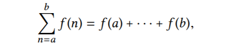
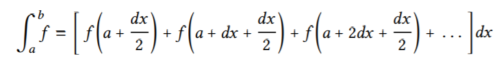

## 1.3 Formulating Abstractions with Higher-Order Procedures

We have seen that procedures are, in effect, **abstractions that describe compound operations on numbers independent of the particular numbers**. For example, when we

```scheme
(define (cube x) (* x x x))
```

we are not talking about the cube of a particular number, but rather about a method for obtaining the cube of any number. Of course we could get along without ever defining this procedure, by always writing expressions such as

```scheme
(* 3 3 3)
(* x x x)
(* y y y)
```

and never mentioning cube explicitly. **This would place us at a serious disadvantage, forcing us to work always at the level of the particular operations that happen to be primitives in the language (multiplication, in this case) rather than in terms of higher-level operations.** Our programs would be able to compute cubes, but our language would lack the ability to express the concept of cubing. **One of the things we should demand from a powerful programming language is the ability to build abstractions by assigning names to common patterns and then to work in terms of the abstractions directly.** Procedures provide this ability. This is why all but the most primitive programming languages include mechanisms for defining procedures.

**并且procedure可以应用递归，这使得可以自动重复应用同一个procedure，这增强了语言的表达能力，否则只有compound expression的话，就只能自己反复手写多个同样的compound expression。**

**Often the same programming pattern will be used with a number of different procedures. To express such patterns as concepts, we will need to construct procedures that can accept procedures as arguments or return procedures as values. Procedures that manipulate procedures are called higher-order procedures.**（注意断句，是a number of而不是a number然后of）

### 1.3.1 Procedures as Arguments

```scheme
(define (sum-integers a b)
  (if (> a b)
      0
      (+ a (sum-integers (+ a 1) b))))

(define (sum-cubes a b)
  (if (> a b)
      0
      (+ (cube a)
         (sum-cubes (+ a 1) b))))

(define (pi-sum a b)
  (if (> a b)
      0
      (+ (/ 1.0 (* a (+ a 2)))
         (pi-sum (+ a 4) b))))
```



**The power of sigma notation is that it allows mathematicians to deal with the concept of summation itself rather than only with particular sums—for example, to formulate general results about sums that are independent of the particular series being summed.**

Similarly, as program designers, **we would like our language to be powerful enough so that we can write a procedure that expresses the concept of summation itself rather than only procedures that compute particular sums.** We can do so readily in our procedural language by taking the common template shown above and transforming the “slots” into formal parameters:

```scheme
; term相当于f(x)，而next则按照caller的意愿得出下一个要被f(x)应用的数。
(define (sum term a next b)
  (if (> a b) ; 递归边界。
      0
      (+ (term a)
         (sum term (next a) next b)))) ; 注意问题的规模缩小了。

(define (cube x) (* x x x))
(define (inc n) (+ n 1))
(define (sum-cubes a b)
  (sum cube a inc b))
(sum-cubes 1 10) ; 3025

(define (identity x) x)
(define (sum-integers a b)
  (sum identity a inc b))
(sum-integers 1 10) ; 55

(define (pi-sum a b)
  (define (pi-term x)
    (/ 1.0 (* x (+ x 2))))
  (define (pi-next x)
    (+ x 4))
  (sum pi-term a pi-next b))
(* 8 (pi-sum 1 1000)) ; 3.139592655589783
```



```scheme
(define (integral f a b dx)
  (define (add-dx x)
    (+ x dx))
  (* (sum f (+ a (/ dx 2.0)) add-dx b)
     dx)) ; 分配律，dx被提出来，只乘一次。

(integral cube 0 1 0.01) ; 0.24998750000000042
(integral cube 0 1 0.001) ; 0.249999875000001
; (The exact value of the integral of cube between 0 and 1 is 1/4.)
```

> Exercise 1.29: Simpson’s Rule is a more accurate method of numerical integration than the method illustrated above.

```scheme
(define (sum term a next b)
  (if (> a b)
      0
      (+ (term a)
         (sum term (next a) next b))))

; h = (b − a)/n, for some even integer n.
(define (simpson f a b n)
  (define h (/ (- b a) n)) ; name definition而不是procedure definition，关联符号与表达式的值。
  (define (inc n) (+ n 1))
  (define fixed-n (if (even? n) n (inc n)))
  (define (new-f k)
    (define y (f (+ a (* k h))))
    (cond ((or (= k fixed-n) (= k 0)) y)
          ((even? k) (* 2 y))
          (else (* 4 y))))
  (* (/ h 3) (sum new-f 0 inc fixed-n)))

(define (cube x) (* x x x))

(simpson cube 0 1.0 100) ; 0.24999999999999992
(simpson cube 0 1.0 1000) ; 0.2500000000000003
```

可以看到，计算精确度确实更好了。

> Exercise 1.30:

```scheme
(define (sum term a next b)
  (define (iter a result)
    (if (> a b)
        result
        (iter (next a) (+ (term a) result))))
  (iter a 0))
```

让上一题的积分过程使用这个迭代过程的sum，会得到相同的结果，所以这个sum的实现是正确的。

> Exercise 1.31:

```scheme
(define (product term a next b)
  (if (> a b)
      1
      (* (term a) (product term (next a) next b))))

(define (product-iter term a next b)
  (define (iter a result)
    (if (> a b)
        result
        (iter (next a) (* result (term a)))))
  (iter a 1))

; n!
(define (factorial n)
  (define (inc n) (+ n 1))
  (define (identity x) x)
  (product identity 1 inc n))

(factorial 4)

; compute approximations to π
(define (pi)
  (define (inc x) (+ x 1))
  ; n从1开始。
  (define (pi-term n)
    (if (even? n)
        (/ (+ n 2) (+ n 1))
        (/ (+ n 1) (+ n 2))))
  (* 4 (product pi-term 1.0 inc 1000)))

(pi) ; 3.143160705532257
```

> Exercise 1.32: A combiner procedure (of two arguments) that specifies how the current term is to be combined with the accumulation of the preceding terms and a null-value that specifies what base value to use when the terms run out. 

```scheme
(define (accumulate combiner null-value term a next b)
  (if (> a b)
      null-value
      (combiner (term a) (accumulate combiner null-value term (next a) next b))))

(define (accumulate-iter combiner null-value term a next b)
  (define (iter a result)
    (if (> a b)
        result
        (iter (next a) (combiner result (term a)))))
  (iter a null-value))

(define (product term a next b)
  (accumulate * 1 term a next b))

(define (sum term a next b)
  (accumulate-iter + 0 term a next b))
```

> Exercise 1.33: You can obtain an even more general version of accumulate (Exercise 1.32) by introducing（介绍、引入） the notion of a filter on the terms to be combined. That is, combine only those terms derived from values in the range that satisfy a specified condition. The resulting filtered-accumulate abstraction takes the same arguments as accumulate, together with an additional predicate of one argument that specifies the filter. Write filtered-accumulate as a procedure. Show how to express the following using filtered accumulate:
>
> 1. the sum of the squares of the prime numbers in the interval（间隔） a to b (assuming that you have a prime? predicate already written)
> 2. the product of all the positive integers less than n that are relatively prime to n (i.e., all positive integersi < n such that (i, n) = 1).

```scheme
; 注意filter不是筛选掉不合格的元素，而是筛选出合格的元素，进行某种运算term后累积。
(define (filtered-accumulate filter combiner null-value term a next b)
  (if (> a b)
      null-value
      (combiner (if (filter a)
                    (term a)
                    null-value)
                (filtered-accumulate filter combiner null-value term (next a) next b))))

(define (square x) (* x x))

(define (find-divisor x test-divisor)
  (cond ((> (square test-divisor) x) x)
        ((= (remainder x test-divisor) 0) test-divisor)
        (else (find-divisor x (+ test-divisor 1)))))

(define (smallest-divisor x)
  (find-divisor x 2))

(define (prime? x)
  (if (= x 1) ; 1不是质数也不是合数。
      #f
      (= (smallest-divisor x) x)))

(define (sum-of-prime-squares a b)
  (filtered-accumulate prime? + 0 square a inc b))

(sum-of-prime-squares 1 5) ; 4+9+25=39
(sum-of-prime-squares 2 10) ; 4+9+25+49=87

(define (gcd a b)
  (if (= b 0) ; 当b或r为0时，返回a。
      a
      (gcd b (remainder a b))))

(define (product-of-relative-primes n)
  (define (filter x) (= (gcd x n) 1))
  (define (identity x) x)
  (filtered-accumulate filter * 1 identity 1 inc n))

(product-of-relative-primes 5) ; 2*3*4=24
(product-of-relative-primes 10) ; 189
```

### 1.3.2 Constructing Procedures Using lambda

```scheme
(lambda (<formal-parameters>) <body>)
```

#### Using let to create local variables

```scheme
; 内部再嵌一个函数，用形式变量来关联局部对象。
(define (f x y)
  (define (f-helper a b)
    (+ (* x (square a))
       (* y b)
       (* a b)))
  (f-helper (+ 1 (* x y))
            (- 1 y)))

(define (f x y)
  ((lambda (a b)
     (+ (* x (square a))
        (* y b)
        (* a b)))
   (+ 1 (* x y))
   (- 1 y)))

(define (f x y)
  (let ((a (+ 1 (* x y)))
        (b (- 1 y)))
    (+ (* x (square a))
       (* y b)
       (* a b))))

(let ((⟨var1⟩ ⟨exp1⟩)
      (⟨var2⟩ ⟨exp2⟩)
      . . .
      (⟨varn⟩ ⟨expn⟩))
  ⟨body⟩)
```

```scheme
(+ (let ((x 3)) ; x是局部于let body的。
     (+ x (* x 10))) ; let body使用值为3的x。
   x) ; 外部的x。

(let ((x 3) ; x是局部于let body的。
      (y (+ x 2))) ; x是外部的。
  (* x y)) ; let body使用的都是局部于let body的x和y。
```

Sometimes we can use internal definitions to get the same effect as with let. For example, we could have defined the procedure f above as

```scheme
(define (f x y)
  (define a (+ 1 (* x y)))
  (define b (- 1 y))
  (+ (* x (square a))
     (* y b)
     (* a b)))
```

We prefer, however, to use let in situations like this and to use internal define only for internal procedures.

> Exercise 1.34: Suppose we define the procedure
>
> ```scheme
> (define (f g) (g 2))
> ```
>
> Then we have
>
> ```scheme
> (f square)
> 4
> (f (lambda (z) (* z (+ z 1))))
> 6
> ```
>
> What happens if we (perversely) ask the interpreter to evaluate the combination (f f)? Explain.

一直应用应用序替换模型即可。

```scheme
(f f)
(f 2)
(2 2)
; application: not a procedure;
; expected a procedure that can be applied to arguments
;  given: 2
;  arguments...:
```

### 1.3.3 Procedures as General Methods

**We introduced compound procedures in Section 1.1.4 as a mechanism for abstracting patterns of numerical operations so as to make them independent of the particular numbers involved. With higher-order procedures, such as the integral procedure of Section 1.3.1, we began to see a more powerful kind of abstraction: procedures used to express general methods of computation, independent of the particular functions involved.**

#### Finding roots of equations by the half-interval method

```scheme
(define (close-enough? x y) (< (abs (- x y)) 0.001))

(define (search f neg-point pos-point)
  (let ((midpoint (average neg-point pos-point)))
    (if (close-enough? neg-point pos-point)
        midpoint
        (let ((test-value (f midpoint)))
          (cond ((positive? test-value)
                 (search f neg-point midpoint))
                ((negative? test-value)
                 (search f midpoint pos-point))
                (else midpoint))))))

(define (half-interval-method f a b)
  (let ((a-value (f a))
        (b-value (f b)))
    (cond ((and (negative? a-value) (positive? b-value))
           (search f a b))
          ((and (negative? b-value) (positive? a-value))
           (search f b a))
          (else
           (error "Values are not of opposite sign" a b)))))
```

#### Finding fixed points of functions

A number x is called a fixed point of a function f if x satisfies the equation f (x) = x. 

```scheme
(define tolerance 0.00001)
(define (fixed-point f first-guess)
  (define (close-enough? v1 v2)
    (< (abs (- v1 v2))
       tolerance))
  (define (try guess)
    (let ((next (f guess)))
      (if (close-enough? guess next)
          next
          (try next))))
  (try first-guess))
```

### 1.3.4 Procedures as Returned Values

The above examples demonstrate（展示、证明、论证） how the ability to pass procedures as arguments significantly（显著地、意味深长地） enhances（提高） the expressive power of our programming language. We can achieve even more expressive power by creating procedures whose returned values are themselves procedures.

#### Newton’s method

As programmers, we should be alert to opportunities to identify the underlying abstractions in our programs and to build upon them and generalize them to create more powerful abstractions. This is not to say that one should always write programs in the most abstract way possible; expert programmers know how to choose the level of abstraction appropriate to their task. **But it is important to be able to think in terms of these abstractions, so that we can be ready to apply them in new contexts.** The significance of higher-order procedures is that they enable us to represent these abstractions explicitly as elements in our programming language, so that they can be handled just like other computational elements.

In general, programming languages impose restrictions on the ways in which computational elements can be manipulated. **Elements with the fewest restrictions are said to have first-class status**. Some of the “rights and privileges” of first-class elements are:

- They may be named by variables.
- They may be passed as arguments to procedures.
- They may be returned as the results of procedures.
- They may be included in data structures.

Lisp, unlike other common programming languages, awards procedures full first-class status.

> Exercise 1.41: 

```scheme
(define (double f)
  (lambda (x) (f (f x))))

(((double (double double)) inc) 5) ; 4个double，一个应用inc两次，所以总共应用16次inc。
```

> Exercise 1.42:

```scheme
; x -> f(g(x))
(define (compose f g)
  (lambda (x) (f (g x))))

((compose square inc) 6) ; 49
```

> Exercise 1.43: 

```scheme
(define (compose f g)
  (lambda (x) (f (g x))))

; x->x+1应用n次得到x->x+n
; x->x^2应用n次得到x->x^(2^n)，（3个2相加是3*2，3个2相乘是2^3）
(define (repeated f n)
  (if (= n 1)
      f
      (repeated (compose f f) (- n 1))))

((repeated square 2) 5) ； 625
```

> Exercise 1.46: Several of the numerical methods described in this chapter **are instances of an extremely general computational strategy known as iterative improvement（所以这就可以进一步提取特征、本质进行抽象）**. Iterative improvement says that, to compute something, we start with an initial guess for the answer, test if the guess is good enough, and otherwise improve the guess and continue the process using the improved guess as the new guess. Write a procedure iterative-improve that takes two procedures as arguments: a method for telling whether a guess is good enough and a method for improving a guess. iterative-improve should return as its value a procedure that takes a guess as argument and keeps improving the guess until it is good enough. Rewrite the sqrt procedure of Section 1.1.7 and the fixed-point procedure of Section 1.3.3 in terms of iterative-improve.

```scheme
(define (iterative-improve good-enough? improve)
  (define (iter guess) (if (good-enough? guess)
                      guess
                      (iter (improve guess))))
  iter)

(define (average x y) (/ (+ x y) 2))

(define (sqrt x)
  ((iterative-improve
   (lambda (guess) (< (abs (- (square guess) x)) 0.0001))
   (lambda (guess) (average guess (/ x guess))))
   1.0))

(sqrt 2)

(define (close-enough? v1 v2) 
  (< (abs (- v1 v2)) tolerance)) 
 
(define (fixed-point f first-guess) 
  ((iterative-improve 
    (lambda (x) (close-enough? x (f x))) 
    f) 
   first-guess)) 
```

