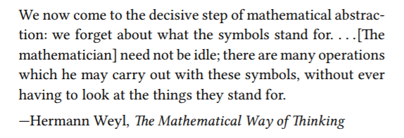

# 2 Building Abstractions with Data



Programs are typically designed to model complex phenomena, and more often than not one（往往、常常） must construct computational objects that have several parts in order to model real-world phenomena that have several aspects. Thus, whereas our focus in chapter 1 was on building abstractions by combining procedures to form compound procedures, we turn in this chapter to another key aspect of any programming language: the means it provides for building abstractions by combining data objects to form compound data.

Why do we want compound data in a programming language? For the same reasons that we want compound procedures: **to elevate the conceptual level at which we can design our programs, to increase the modularity of our designs, and to enhance the expressive power of our language. Just as the ability to define procedures enables us to deal with processes at a higher conceptual level than that of the primitive operations of the language, the ability to construct compound data objects enables us to deal with data at a higher conceptual level than that of the primitive data objects of the language.**

## 2.1 Introduction to Data Abstraction

**The basic idea of data abstraction is to structure the programs that are to use compound data objects so that they operate on “abstract data.” That is, our programs should use data in such a way as to make no assumptions about the data that are not strictly necessary for performing the task at hand.**

### 2.1.1 Example: Arithmetic Operations for Rational Numbers

```scheme
; 如果没有数据抽象：
(define (add-numerator n1 n2)
  (+ n1 n2))
(define (add-denominator d1 d2)
  (+ d1 d2))

(define (gcd a b)
  (if (= b 0) ; 当b或r为0时返回a。
      a
      (gcd b (remainder a b))))

; (define (make-rat n d) (cons n d))
(define (make-rat n d)
  (let ((g (abs (gcd n d))))
    (cons (/ n g) (/ d g)))) ; 也可以在selector中进行reduce。
(define (numer x) (car x))
(define (denom x) (cdr x))

; (define make-rat cons)
; (define numer car)
; (define denom cdr)

(define (add-rat x y)
  (make-rat (+ (* (numer x) (denom y))
               (* (numer y) (denom x)))
            (* (denom x) (denom y))))
(define (sub-rat x y)
  (make-rat (- (* (numer x) (denom y))
               (* (numer y) (denom x)))
            (* (denom x) (denom y))))
(define (mul-rat x y)
  (make-rat (* (numer x) (numer y))
            (* (denom x) (denom y))))
(define (div-rat x y)
  (make-rat (* (numer x) (denom y))
            (* (denom x) (numer y))))
(define (equal-rat? x y)
  (= (* (numer x) (denom y))
     (* (numer y) (denom x))))

(define (print-rat x)
  (newline)
  (display (numer x))
  (display "/")
  (display (denom x)))

(define one-third (make-rat 1 3))
(define one-half (make-rat 1 6))
(print-rat (add-rat one-third one-half)) ; 1/2
```

> Exercise 2.1: Define a beer version of make-rat that handles both positive and negative arguments. make-rat should normalize the sign so that if the rational number is positive, both the numerator and denominator are positive, and if the rational number is negative, only the numerator is negative.

```scheme
; (define (make-rat n d)
;   (let ((g (abs (gcd n d))))
;     (cond ((and (< n 0) (< d 0)) (cons (/ (- n) g) (/ (- d) g)))
;           ((and (> n 0) (< d 0)) (cons (/ (- n) g) (/ (- d) g)))
;           (else (cons (/ n g) (/ d g))))))
; 更简洁的实现，利用不论是题目中描述的哪种情况，共同点都是分母最终都为正，所以只要分母为负，就让分子分母同除一个负数，否则，同除一个正数。
(define (make-rat n d)
  (let ((g ((if (< d 0) - +) (abs (gcd n d)))))
    (cons (/ n g) (/ d g))))

(print-rat (make-rat 6 9)) ; 2/3 
(print-rat (make-rat -6 9)) ; -2/3 
(print-rat (make-rat 6 -9)) ; -2/3 
(print-rat (make-rat -6 -9)) ; 2/3
(print-rat (make-rat 1 -2)) ; -1/2
(print-rat (make-rat 6 -9)) ; -2/3
```

### 2.1.2 Abstraction Barriers


**In effect, procedures at each level are the interfaces that define the abstraction barriers and connect the different levels.**

**At each level, the barrier separates the programs (above) that use the data abstraction from the programs (below) that implement the data abstraction.** 

> Exercise 2.2:

```scheme
;; ex 2.2.  Straightforward 
  
;; Point 
(define (make-point x y) (cons x y)) 
(define (x-point p) (car p)) 
(define (y-point p) (cdr p)) 
(define (print-point p) 
  (newline) 
  (display "(") 
  (display (x-point p)) 
  (display ",") 
  (display (y-point p)) 
  (display ")")) 
 
;; Segment 
(define (make-segment start-point end-point) 
  (cons start-point end-point)) 
(define (start-segment segment) (car segment)) 
(define (end-segment segment) (cdr segment)) 
 
(define (midpoint-segment segment) 
  (define (average a b) (/ (+ a b) 2.0)) 
  (let ((a (start-segment segment)) 
        (b (end-segment segment))) 
    (make-point (average (x-point a) 
                         (x-point b)) 
                (average (y-point a) 
                         (y-point b))))) 
 
;; Testing 
(define seg (make-segment (make-point 2 3) 
                          (make-point 10 15))) 
 
(print-point (midpoint-segment seg)) 
```

lackita: **I think the above solution misses part of the point about abstraction barriers; midpoint-segment reaches through both layers to achieve its goal.**

```scheme
(define (average-points a b) 
  (make-point (average (x-point a) (x-point b)) 
              (average (y-point a) (y-point b)))) 
 
(define (midpoint-segment seg) 
  (average-points (start-segment seg) 
                  (end-segment seg))) 
```

>Exercise 2.3:

http://community.schemewiki.org/?sicp-ex-2.3

### 2.1.3 What Is Meant by Data?

```scheme
(define (cons x y)
  (define (dispatch m)
    (cond ((= m 0) x)
          ((= m 1) y)
          (else (error "Argument not 0 or 1: CONS" m))))
  dispatch)
(define (car z) (z 0))
(define (cdr z) (z 1))
```

> Exercise 2.4:

```scheme
(define (cons x y)
  (lambda (m) (m x y)))
(define (car z)
  (z (lambda (p q) p)))
(define (cdr z)
  (z (lambda (p q) q)))
```

> Exercise 2.6: Church numerals.

http://community.schemewiki.org/?sicp-ex-2.6

http://markmiyashita.com/cs61a/higher_order_functions/church_numerals/

### 2.1.4 Extended Exercise: Interval Arithmetic

