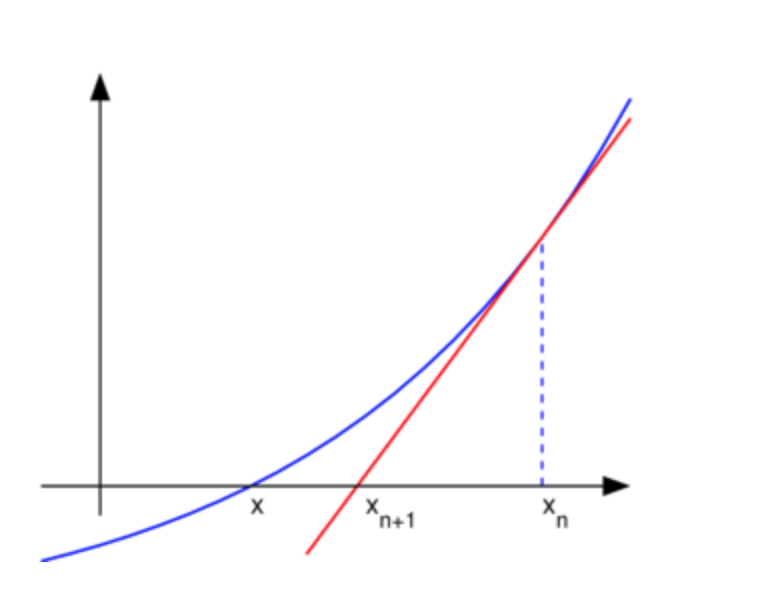
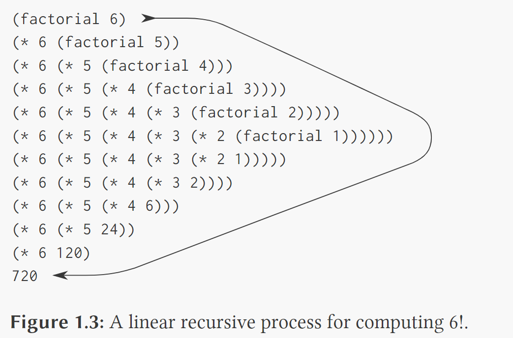
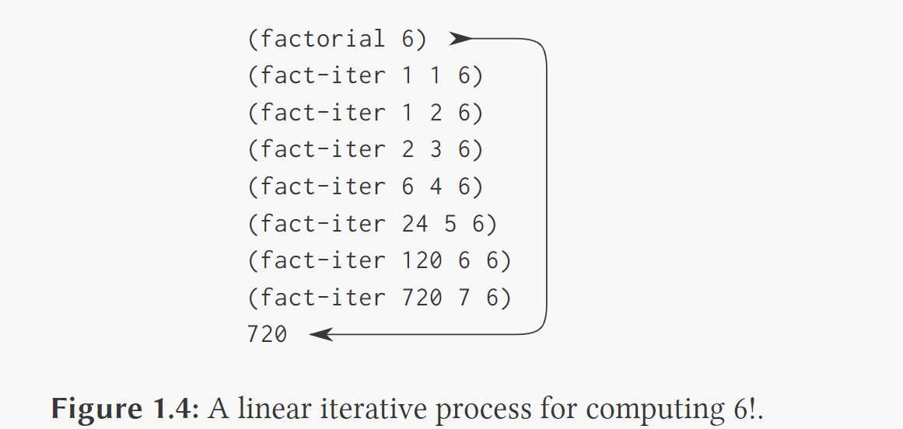

## 1.1 程序设计的基本要素

在程序设计中，我们需要处理两类要素：过程和数据。非形式地说，数据是一种我们希望去操作的“东西”（一个浮点数、一张图片、一个视频等二进制序列），而过程是有关操作这些数据的规则的描述（机器指令序列）。

***

**程序设计语言中一个必不可少的方面，就是它需要提供一种通过名字去使用计算对象的方式。我们将名字标识符称为变量，它的值也就是它对应的那个对象**。

Wiki对变量的定义：

> Variable (computer science), a symbolic name associated with a value and whose associated value may be changed

对象是在内存中存在的bit序列，可以是（被解释为）一个整数、浮点数、一个结构实体、一个类实体、一个函数、一个类方法、一个视频等，而变量是一个符号，与对应的对象关联，可以认为变量则是对象的内存地址（编译后）。

**由此，变量 != 对象**。

***

环境，第3章。

***

正则序求值：完全展开而后归约的求值模型。

应用序求值：先求值参数而后应用的求值模型。

解释器实际使用后者。

谓词：返回真或假的过程。

注意，and和or都是特殊形式而不是普通的过程，因为它们的子表达式不一定都求值，not则是一个普通的过程。

```scheme
; http://community.schemewiki.org/?sicp-ex-1.5

(define (p) (p))

(define (test x y)
  (if (= x 0)
      0
      y))

; 求值以下表达式：
(test 0 (p))

; 对正则序，会无限展开。
; 对应用序，结果为0。
```

***

实例：采用牛顿法求平方根(square root，简写为sqrt)。




```scheme
(define (square x)
  (* x x))

(define (sqrt_iter guess x)
  (if (good_enough? guess x)
      guess	; 足够好就返回这个猜测
      (sqrt_iter (improve guess x) ; 否则继续迭代（尾递归）
                 x)))

(define (improve guess x)
  (/ (+ guess (/ x guess)) 2))

(define (good_enough? guess x)
  (< (abs (- (square guess) x)) 0.0001))

(define (sqrt x)
  (sqrt_iter 1.0 x))

(sqrt 9) ; 3.000000001396984
```

```scheme
; http://community.schemewiki.org/?sicp-ex-1.7
; 对于求很小的数或很大的数的平方根，上面的good_enough?并不好。

; The absolute tolerance of 0.001 is significantly large when computing the square root of a small value. For example, on the system I am using, (sqrt 0.0001) yields 0.03230844833048122 instead of the expected 0.01 (an error of over 200%).
; 对于很大的数，两个大数(square guess)和x的差的绝对值可能总大于0.0001，于是就会一直迭代下去。

; 实现good_enough?的另一种策略是监视猜测值在从一次迭代到下一次的变化情况，当新值相对于旧值的比率很小时结束过程。
(define (good_enough? guess x)
  (<= (abs (- (improve guess x) guess))
     (* guess .0001)))
; 不能简单地用`旧值/新值`，因为可能旧值比新值大，也可能新值比旧值大。
```

***

```scheme
; http://community.schemewiki.org/?sicp-ex-1.6
; 为什么需要将if提供为一种特殊形式，而不能直接用cond将if定义为一个常规过程？

(define (new_if predicate then_clause else_clause)
  (cond (predicate then_clause)
        (else else_clause)))

(new_if (= 2 3) 0 5) ; 5

; 然而，

(define (sqrt_iter guess x)
  (new_if (good_enough? guess x)
      guess
      (sqrt_iter (improve guess x)
                 x)))

; 会陷入无限递归。
; 原因是内置if是一种特殊形式而不是普通的过程，它只会计算谓词以及两个子句中的一个，因为谓词不会即为真又为假。而new_if是一个普通的过程，因为解释器采用应用序求值，所以会对new_if的三个参数都求值，在这个例子中，对第三个参数的求值会进入递归调用sqrt_iter，然后再次对new_if的三个参数求值，接着又递归调用sqrt_iter，导致无限递归。
; 与if相似的还有cond, or, and等。
```

***

过程作为黑箱抽象，一个过程定义应该能隐藏起一些细节，这将使过程的使用者可能不必自己去实现这些过程， 而是从其它程序员那里作为一个黑箱而接受了它。用户在使用一个过程时，应该不需要去弄清楚它是如何实现的。

过程要作为黑箱，过程的形式参数必须是约束变量，如果不是，该过程就会依赖于用户的环境，不方便用户使用。

```scheme
(define (sqrt x)
  (define (improve guess)
    (/ (+ guess (/ x guess)) 2))
  (define (good_enough? guess)
    (<= (abs (- (improve guess) guess))
     (* guess .0001)))
  (define (sqrt_iter guess)
    (if (good_enough? guess)
      guess
      (sqrt_iter (improve guess))))
  (sqrt_iter 1.0))
```

上面的x是sqrt的约束变量，是sqrt中定义的过程的自由变量。

***

线性递归过程：先逐步展开后收缩的计算过程，展开阶段构造出一个推迟进行的操作所形成的链条，收缩阶段实际执行这些运算。往往递归调用作为参数时，由于解释器采用应用序求值，该过程的计算过程是该类型。

线性迭代过程：其状态可以用固定数目的**状态变量**描述的计算过程。一般存在尾递归的递归过程的计算过程是该类型。





注意区别递归计算过程和递归过程的概念，前者是说某一计算过程具有某种模式，说的是这一计算过程的进展方式，后者论述的是一种语法形式上的事实，说明这个过程的定义中（直接或间接地）引用了该过程本身。

专门的迭代结构其实是尾递归的语法糖。

```scheme
; http://community.schemewiki.org/?sicp-ex-1.10
(define (A x y)
  (cond ((= y 0) 0)
        ((= x 0) (* 2 y))
        ((= y 1) 2)
        (else (A (- x 1)
                 (A x (- y 1))))))

(define (f n) (A 0 n)) ; 2n
(define (g n) (A 1 n)) ; 2^{n}
(define (h n) (A 2 n)) ; 2^2^… (n-1 times)

; 在求得前两个的情况下，对最后一个展开：
; (A 2 n)
; (A 1 (A 2 (n-1))) 			-> 2^{(A 2 (n-1))}
; (A 1 (A 1 (A 2 (n-1)))) 		-> 2^2^{(A 2 (n-2))}
; ...
; (A 1 (A 1 ... (A 1 (A 2 1)))	-> 2^2^...^2（共n个2）
```

***

当我们考虑的是在层次结构性的数据上操作，而不是对数操作时，将会发现树形递归计算过程是一种自然的、威力强大的工具。

实例：换零钱方式的统计。

将总数为a的现金换成n种硬币的不同方式的数目等于：

- 将现金a换成除第一种硬币之外的其它硬币的不同方式数目（完全不使用第一种硬币），加上
- 将现金a-d换成所有种类的硬币的不同方式数目（都使用了第一种硬币，币值d）。

```scheme
(define (count_change amount)
  (cc amount 5))

(define (cc amount kinds_of_coins)
  (cond ((= amount 0) 1)
        ((or (< amount 0) (= kinds_of_coins 0)) 0)
        (else (+ (cc amount
                     (- kinds_of_coins 1))
                 (cc (- amount (first_denomination kinds_of_coins))
                     kinds_of_coins)))))

(define (first_denomination kinds_of_coins)
  (cond ((= kinds_of_coins 1) 1) ; 1美分
        ((= kinds_of_coins 2) 5)
        ((= kinds_of_coins 3) 10)
        ((= kinds_of_coins 4) 25)
        ((= kinds_of_coins 5) 50))) ; 半美分

(count_change 100)
```

和计算斐波那契的递归方式一样，该程序会产生大量冗余计算，可以通过用表记住计算结果来优化。

***

```scheme
; http://community.schemewiki.org/?sicp-ex-1.11
; 当n<3时，f(n)=n，当n>=3时，f(n)=f(n-1)+2f(n-2)+3f(n-3)。

(define (ex1-11-recursive n)
  (cond ((< n 3) n) ; 参数中包含递归调用的递归计算过程
        (else (+ (ex1-11-recursive (- n 1)) (* 2 (ex1-11-recursive (- n 2))) (* 3 (ex1-11-recursive (- n 3)))))))

(define (ex1-11-iterative n)
  (define (iter a b c count) ; 使用状态变量描述状态的迭代计算过程
    (if (= count 0) a (iter b c (+ c (* 2 b) (* 3 a)) (- count 1))))
  (iter 0 1 2 n))

(ex1-11-recursive 0)
(ex1-11-recursive 1)
(ex1-11-recursive 2)
(ex1-11-recursive 3)
(ex1-11-recursive 4)
(ex1-11-recursive 5)
(ex1-11-recursive 6)
```

***

```scheme
; https://sicp.readthedocs.io/en/latest/chp1/12.html

; (r, c) = (r-1, c-1) + (r-1, c)
; 较慢的递归
(define (pascal r c) 
  (if (or (= c 1) (= c r))  ; 每一行最左边的列和最右边的列为1
      1 
      (+ (pascal (- r 1) (- c 1)) (pascal (- r 1) c)))) 

; (r, c) = r!/(c!(r-c)!)
; 较快的迭代
(define (factorial n)
    (fact-iter 1 1 n))

(define (fact-iter product counter max-count)
    (if (> counter max-count)
        product
        (fact-iter (* counter product)
                   (+ counter 1)
                   max-count)))

(define (pascal row col)
    (/ (factorial row)
       (* (factorial col)
          (factorial (- row col)))))
```

***

求幂可定义为：

b^n = b*b^(n-1), b^0 = 1

更好的定义为：

b^n = [b^(n/2)]^2，n为偶数

b^n = b*b^(n-1)，n为奇数

```scheme
; http://community.schemewiki.org/?sicp-ex-1.16
; 写出迭代计算的求幂过程。
; exponentiation 求幂
(define (fast_expt_iter b n)
  (define (square x) (* x x))
  (define (iter b n a)
    (cond ((= n 0) a)
          ((even? n) (iter (square b) (/ n 2) a))
          (else (iter b (- n 1) (* a b)))))
  (iter b n 1))

(fast_expt_iter 2 2)
(fast_expt_iter 2 16)

; 利用上面的第二个定义，除了指数n和基数b外，还应维持一个附加的状态变量a，并定义好状态变换，使得从一个状态转到另一个状态时a*b^n不变。
; 一般说，定义一个不变量，要求它在状态之间保持不变，这一技术是思考迭代算法设计问题时的一种非常强有力的方法。
```

***

```scheme
; http://community.schemewiki.org/?sicp-ex-1.18
; a*b可看作b个a相加。
; a*b = (a*2)*(b/2)，若b是偶数
; a*b = a + a*(b-1)，若b是奇数
(define (* a b c)
  (define (double x)
    (+ x x)) ; 注意这里不能用(* 2 x)
  (define (halve x) ; x要求是偶数
    (/ x 2))
  (cond ((= b 0) c)
        ((even? b) (* (double a) (halve b) c))
        (else (* a (- b 1) (+ c a))))) ; 如果b是奇数，最后肯定执行这一子句，若b是偶数，由于除2最终得到1，也会执行这一子句，把结果累加到c上。

(* 7 4 0)
(* 5 3 0)
```

***

```scheme
; 最大公约数的欧几里得算法：GCD(a, b) = GCD(b, r)
(define (gcd a b)
  (if (= b 0)
      a
      (gcd b (remainder a b))))

(gcd 206 40)
```

***

高阶过程：以过程为参数或返回过程的过程。

```scheme
; 1.30
(define (sum term a next b)
  (if (> a b)
      0
      (+ (term a)
         (sum term (next a) next b))))

(define (sum_iter term a next b)
  (define (iter a result)
    (if (> a b)
        result
        (iter (next a) (+ result (term a)))))
  (iter a 0))

(define (cube x)
  (* x x x))

(sum cube 2 (lambda (x) (+ x 1)) 3)
(sum_iter cube 2 (lambda (x) (+ x 1)) 3)
```


