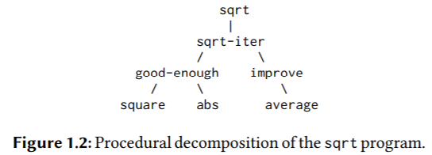
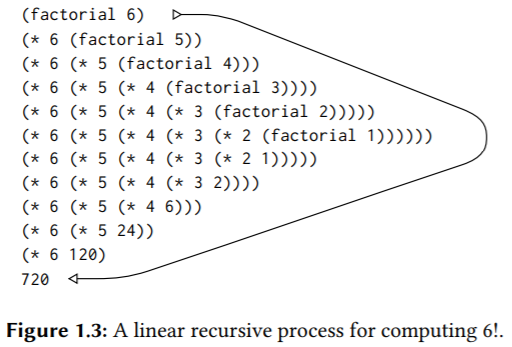
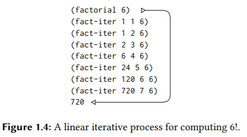
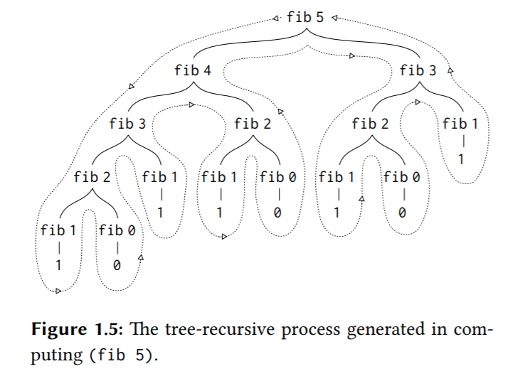
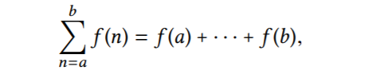
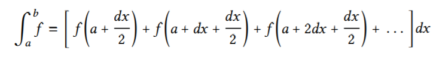

# 1 Building Abstractions with Procedures

## 1.1 The Elements of Programming

一门强大的语言应该提供的机制有：

- 提供基本元素，cons，cond，5，8.3，+，*，remainder等；
- 提供组合的方法，这样我们可以组合基本元素，做更多更复杂的事情；
- 提供抽象的方法（过程定义，名字定义），这样我们才可以制作黑盒子，把这些黑盒子当做新的基本元素去构建更复杂的东西。哪些基本元素是语言提供的，哪些是我们自己定义的黑盒子，“无法区分”，也不需要区分。

```scheme
(* 3 3 3)
(* x x x)
(* y y y)
; 通过过程定义制作一个黑盒子：
(define (cube x) (* x x x))
(cube 1001) ; 新的基本元素。
```

想象一下，如果没有黑盒抽象， 那么每次我们都只能用语言提供的基本元素来编程，而且存在大量重复的代码，而且我们无法直观看出这些代码的功能、作用，因为没有名字。

Our programs would be able to compute cubes, but our language would lack the ability to express the concept of cubing. **One of the things we should demand from a powerful programming language is the ability to build abstractions by assigning names to common patterns and then to work in terms of the abstractions directly.（这样我们就可以在更高的抽象层级上工作，使用更高级的概念更方便、直观地表达我们的想法，比如想表达要对一个数开三次方，是`cube(3)`好还是`* 3 3 3`好？这还只是简单的例子，遇到复杂情况时，这个比较的优劣会更明显）** Procedures provide this ability. This is why all but the most primitive programming languages include mechanisms for defining procedures.

|                      | PROCEDURES        | DATA     |
| -------------------- | ----------------- | -------- |
| PRIMITIVE ELEMENTS   | + * < = COND CONS | 23 1.738 |
| MEANS OF COMBINATION | (+ 2 3)           | CONS     |
| MEANS OF ABSTRACTION | DEFINE            | DEFINE   |

### [表达式求值规则](./evalRules)

### 两种求值模型

- normal-order evaluation: “fully expand and then reduce”.

- applicative-order evaluation: “evaluate the arguments and then apply”.

lisp用的是后者，上面描述的也是后者。

正则序的一个缺点是会产生重复计算，当然它也有自己适用的领域。

```scheme
(sum-of-squares (+ 5 1) (* 5 2))
(+ (square (+ 5 1)) (square (* 5 2)) )
(+ (* (+ 5 1) (+ 5 1)) (* (* 5 2) (* 5 2)))
(+ (* 6 6) (* 10 10))
(+ 36 100)
136
```

> Exercise 1.5: Ben Bitdiddle has invented a test to determine whether the interpreter he is faced with is using applicative order evaluation or normal-order evaluation. He defines the following two procedures:
>
> ```scheme
> (define (p) (p))
> (define (test x y)
> (if (= x 0) 0 y))
> ```
>
> Then he evaluates the expression
>
> ```scheme
> (test 0 (p))
> ```
>
> What behavior will Ben observe with an interpreter that uses applicative-order evaluation? What behavior will he observe with an interpreter that uses normal-order evaluation? Explain your answer.

如果是正则序，会无尽地展开：

```scheme
(test 0 (p))
(test 0 (p))
(test 0 (p))
```

如果是应用序，会先求值实参：

```scheme
(test 0 (p))
(if (= 0 0) 0 (p))
(if #t 0 (p))
0
```

### 1.1.7 Example: Square Roots by Newton’s Method

```scheme
(define (square x)
  (* x x))
(define (average x y)
  (/ (+ x y) 2))
(define (improve guess x)
  (average (/ x guess) guess))
(define (good-enough? guess x)
  (< (abs (- (square guess) x)) 0.001))
(define (sqrt-iter guess x)
  (if (good-enough? guess x)
      guess
      (sqrt-iter (improve guess x) x)))

(define (sqrt x)
  (sqrt-iter 1.0 x)) ; 注意这里要传递1.0而不是1，这样才会将结果显式为小数而不是分数。

(sqrt 9)
(sqrt 2)
(square (sqrt 1000))
```

> Exercise 1.6: Alyssa P. Hacker doesn’t see why if needs to be provided as a special form. “Why can’t I just define it as an ordinary procedure in terms of cond?” she asks. Alyssa’s friend Eva Lu Ator claims this can indeed be done, and she defines a new version of if:
>
> ```scheme
> (define (new-if predicate then-clause else-clause)
> (cond (predicate then-clause)
>      (else else-clause)))
> ```
>
> Eva demonstrates the program for Alyssa:
>
> ```scheme
> (new-if (= 2 3) 0 5)
> 5
> (new-if (= 1 1) 0 5)
> 0
> ```
>
> Delighted, Alyssa uses new-if to rewrite the square-root program:
>
> ```scheme
> (define (sqrt-iter guess x)
> (new-if (good-enough? guess x)
>        guess
>        (sqrt-iter (improve guess x) x)))
> ```
>
> What happens when Alyssa attempts to use this to compute square roots? Explain.

按照应用序求值规则，会先求值实参，而new-if会求值所有的子句，而不是像内置的if那样根据断言只求值其中的一个子句，所以会无限递归。

> Exercise 1.7: The good-enough? test used in computing square roots will not be very effective for finding the square roots of very small numbers. Also, in real computers, arithmetic operations are almost always performed with limited precision. This makes our test inadequate for very large numbers. Explain these statements, with examples showing how the test fails for small and large numbers. An alternative strategy for implementing good-enough? is to watch how guess changes from one iteration to the next and to stop when the change is a very small fraction of the guess. Design a square-root procedure that uses this kind of end test. Does this work better for small and large numbers?

0.001的绝对容错，对于比较小的数，太大：

```scheme
(sqrt 0.0001) ; 0.03230844833048122
```

对于比较大的被开方数(radicand)，用浮点数存储时，留给小数部分的位数很少，导致两数相减总是会大于0.001。

```scheme
(sqrt 1000000000000) ; 1000000.0
(sqrt 10000000000000) ; endless loop
; The algorithm gets stuck because (improve guess x) keeps on yielding 4472135.954999579 but (good-enough? guess x) keeps returning #f.
```

```scheme
;; Modified version to look at difference between iterations 
(define (good-enough? guess x) 
 (< (abs (- (improve guess x) guess)) 
    (* guess .001)))
```

> [random person]: I don't see why (* guess 0.001) is used. Just '0.001' or whatever tolerance desired seems to work fine. It would be nice if someone explained above if there is a reason why the (* guess 0.001) is better.
>
> [SchemeNewb]: Just using 0.001 is, in effect, doing the same thing as the original program. It basically says "If the difference between this guess and improved guess is less than 0.0001 in absolute terms (as opposed to percent terms) then stop improving." Problem with this is the same as explained up top. For really tiny numbers, it is easy for the total difference between guess and improve guess to be less than .0001 and for the program to stop without actually doing anything. For large numbers, it might take forever to get to where guess and improved guess are less than .0001. So the book asks us to stop the program if improved guess is less than a certain PERCENT of guess. And THAT is what this alternative does. It checks to see how close guess and improved guess are as a percent. It basically says: "figure out how far guess is from improved guess and then see if that amount is less than .1% of guess. If it is, stop the program"

反正一个点是在这里要用相对值而不是绝对值来衡量误差。

### 1.1.8 Procedures as Black-Box Abstractions

黑盒抽象是控制复杂度的技术之一。



**The importance of this decomposition strategy is not simply that one is dividing the program into parts. After all, we could take any large program and divide it into parts—the first ten lines, the next ten lines, the next ten lines, and so on. Rather, it is crucial that each procedure accomplishes an identifiable task that can be used as a module in defining other procedures.**

## 1.2 Procedures and the Processes They Generate

**To become experts, we must learn to visualize the processes generated by various types of procedures. Only after we have developed such a skill can we learn to reliably construct programs that exhibit the desired behavior.**

The evolution of a process is directed by a pattern of rules called a program. People create programs to direct processes.

procedure是process的一种形式上的描述，静态的procedure，动态的procees。

下面是几种典型的process的形状(shape)。

```scheme
(define (factorial n)
  (if (= n 1)
      1
      (* n (factorial (- n 1)))))

(define (factorial n)
  (fact-iter 1 1 n))
(define (fact-iter product counter max-count) ; counter是循环变量。
  (if (> counter max-count)
      product
      (fact-iter (* counter product)
                 (+ counter 1)
                 max-count)))

(define (fib n)
  (cond ((= n 0) 0)
        ((= n 1) 1)
        (else (+ (fib (- n 1))
                 (fib (- n 2))))))

(define (fib n)
  (fib-iter 1 0 n))
(define (fib-iter a b count)
  (if (= count 0)
      b
      (fib-iter (+ a b) a (- count 1))))
```







线性递归空间复杂度一般O(N)，线性迭代过程一般为O(1)。

递归过程一般会延迟计算，所以它要自己保存一点额外的状态供延迟计算。而迭代过程会马上根据现有状态计算出下一个状态，所以一般它就不需要额外保存什么状态了，只需要把计算出的下一个状态传递下去即可。

过程定义这种抽象方法，不仅可以表达一些操作的通用形式，而且，通过上面的例子可以看出，借助递归，它能重复做一件事，按照我们给出的规则自动演化，而不需要我们把每一步都手写出来。

### Example: Counting change

```scheme
(define (count-change amount) (cc amount 5))
(define (cc amount kinds-of-coins)
  (cond ((= amount 0) 1) ; 恰好零钱换到0，即这是一条有效的路径，即这是一种有效的兑换零钱的方式，故返回1。
        ((or (< amount 0) (= kinds-of-coins 0)) 0) ; 第一个条件表示零钱兑换溢出了，这是一种不合法的兑换方式，所以返回0。
        (else (+ (cc amount (- kinds-of-coins 1)) ; 不使用当前硬币。
                 (cc (- amount (first-denomination kinds-of-coins)) kinds-of-coins))))) ; 使用当前硬币A，注意进入下一次调用后，也会有两个分支，一个不再使用硬币A，一个继续使用硬币A。

(define (first-denomination kinds-of-coins) ; 一个数组或哈希表。
  (cond ((= kinds-of-coins 1) 1)
      ((= kinds-of-coins 2) 5)
      ((= kinds-of-coins 3) 10)
      ((= kinds-of-coins 4) 25)
      ((= kinds-of-coins 5) 50)))

(count-change 100)
```

### 1.2.4 Exponentiation

```scheme
; 快递幂。
; b^n = (b^(n/2))^2, if n is even,
; b^n = (b*b^(n-1)), if n is odd.
; 时间复杂度O(logn)。
; 该算法无法处理指数为负数的情况。
(define (fast-exp b n)
  (define (square x) (* x x))
  (define (even? x) (= (remainder x 2) 0))
  (cond ((= n 0) 1)
        ((even? n) (square (fast-exp b (/ n 2))))
        (else (* b (fast-exp b (- n 1))))))

(fast-exp -2 8)
```

> Exercise 1.16: 

```scheme
; n/2相当于二进制右移一位。若n是奇数，那么减一会将二进制最低位置0。
; (b^(n/2))^2 = (b^2)^(n/2)，这样就可以把递归过程转换为迭代过程了，这是n是偶数的情况，对于n是奇数，那就从b^n中提一个b，使n变为偶数。
; 迭代过程保持一个不变量，即a*(b^n)，对n的削减，会将效果转移到a或b上去。
; XXX In general, the technique of defining an invariant quantity that remains unchanged from state to state is a powerful way to think about the design of iterative algorithms.
; 如加法的迭代版本，a+b，就是每次从a中取1，放到b上去，不变量就是a+b。
(define (fast-exp b n)
  (define (iter a b n)
    (cond ((= n 0) a)
          ((even? n) (iter a (square b) (/ n 2)))
          (else (iter (* a b) b (- n 1)))))
  (define (square x)
    (* x x))
  (define (even? n) ; 其实也是判断最低位是0还是1。
    (= (remainder n 2) 0))
  (iter 1 b n))

(fast-exp 2 7)

; 算法笔记4.5的写法。
  (define (iter a b n)
    (cond ((= n 0) a)
          ((even? n) (iter a (square b) (/ n 2)))
          (else (iter (* a b) (square b) (/ n 2))))) ; 没法这么写，因为执行的不是整数除法，效果不等于仅仅右移消除n的二进制最低位。
```

### The Fermat test

> Fermat’s Little Theorem: If n is a prime number and a is any positive integer less than n, then a raised to the nth power is congruent to a modulo n.

```scheme
(define (square x) (* x x))

(define (even? x) (= (remainder x 2) 0))

(define (expmod base exp m)
  (cond ((= exp 0) 1)
        ((even? exp) (remainder
                      (square (expmod base (/ exp 2) m))
                      m))
        (else (remainder
               (* base (expmod base (- exp 1) m))
               m))))

; 注意学习这个函数的写法， 由于实参表达式比较长和复杂，且函数体中要用到多处，所以我们最好把该表达式的值用一个对象存储起来，这里用内部函数的形参对象存储，也是一样的。
(define (fermat-test n)
  (define (try-it a)
    (= (expmod a n n) a)) ; a是一个小于n的数，a%n=a，若a^n%n=a，则a^n≡a(mod n)
  (try-it (+ 1 (random (- n 1)))))

(define (fast-prime? n times)
  (cond ((= times 0) #t)
        ((fermat-test n) (fast-prime? n (- times 1)))
        (else #f)))

(fast-prime? 4 5) ; #f
(fast-prime? 13 5) ; #t
```

有一些数字可以使该算法失效，它们不是质数，但对于任何小于它的正数，都能通过费马检测。

> Exercise 1.25: Alyssa P. Hacker complains that we went to a lot of extra work in writing expmod. After all, she says, since we already know how to compute exponentials, we could have simply written
>
> ```scheme
> (define (expmod base exp m)
>   (remainder (fast-expt base exp) m))
> ```
>
> Is she correct? Would this procedure serve as well for our fast prime tester? Explain.

> **The modified version of `expmod` computes huge intermediate results.**
>
> Scheme is able to handle arbitrary-precision arithmetic, but arithmetic with arbitrarily long numbers is computationally expensive. This means that we get the same (correct) results, but it takes considerably longer.
>
> For example:
>
> ```scheme
> (define (square m)  
>   (display "square ")(display m)(newline) 
>   (* m m)) 
>  
> => (expmod 5 101 101) 
> square 5 
> square 24 
> square 71 
> square 92 
> square 1 
> square 1 
> 5 
> => (remainder (fast-expt 5 101) 101) 
> square 5 
> square 25 
> square 625 
> square 390625 
> square 152587890625 
> square 23283064365386962890625 
> 5 
> ```
>
> **The `remainder` operation inside the original `expmod` implementation, keeps the numbers being squared less than the number tested for primality `m`. `fast-expt` however squares huge numbers of `a^m` size.**

> Exercise 1.26: "By writing the procedure like that, you have transformed the Θ(logn) process into a Θ(n) process." Explain.
>
> ```scheme
> (define (expmod base exp m)
>   (cond ((= exp 0) 1)
>         ((even? exp)
>          (remainder (* (expmod base (/ exp 2) m)
>                        (expmod base (/ exp 2) m))
>                     m))
>         (else
>          (remainder (* base
>               (expmod base (- exp 1) m))
>                     m))))
> ```

原本的线性递归变成了树形递归，且多了许多不必要的重复计算，时间复杂度不是O(logn)而变成了O(n)。

## 1.3 Formulating Abstractions with Higher-Order Procedures

```scheme
(define (sum-integers a b)
  (if (> a b)
      0
      (+ a (sum-integers (+ a 1) b))))

(define (sum-cubes a b)
  (if (> a b)
      0
      (+ (cube a)
         (sum-cubes (+ a 1) b))))

(define (pi-sum a b)
  (if (> a b)
      0
      (+ (/ 1.0 (* a (+ a 2)))
         (pi-sum (+ a 4) b))))
```



**The power of sigma notation is that it allows mathematicians to deal with the concept of summation itself rather than only with particular sums—for example, to formulate general results about sums that are independent of the particular series being summed.**

Similarly, as program designers, **we would like our language to be powerful enough so that we can write a procedure that expresses the concept of summation itself rather than only procedures that compute particular sums.** We can do so readily in our procedural language by taking the common template shown above and transforming the “slots” into formal parameters:

```scheme
; term相当于f(x)，而next则按照caller的意愿得出下一个要被f(x)应用的数。
(define (sum term a next b)
  (if (> a b) ; 递归边界。
      0
      (+ (term a)
         (sum term (next a) next b)))) ; 注意问题的规模缩小了。

(define (cube x) (* x x x))
(define (inc n) (+ n 1))
(define (sum-cubes a b)
  (sum cube a inc b))
(sum-cubes 1 10) ; 3025

(define (identity x) x)
(define (sum-integers a b)
  (sum identity a inc b))
(sum-integers 1 10) ; 55

(define (pi-sum a b)
  (define (pi-term x)
    (/ 1.0 (* x (+ x 2))))
  (define (pi-next x)
    (+ x 4))
  (sum pi-term a pi-next b))
(* 8 (pi-sum 1 1000)) ; 3.139592655589783
```



```scheme
(define (integral f a b dx)
  (define (add-dx x)
    (+ x dx))
  (* (sum f (+ a (/ dx 2.0)) add-dx b)
     dx)) ; 分配律，dx被提出来，只乘一次。

(integral cube 0 1 0.01) ; 0.24998750000000042
(integral cube 0 1 0.001) ; 0.249999875000001
; (The exact value of the integral of cube between 0 and 1 is 1/4.)
```

In general, programming languages impose restrictions on the ways in which computational elements can be manipulated. **Elements with the fewest restrictions are said to have first-class status**. Some of the “rights and privileges” of first-class elements are:

- They may be named by variables.
- They may be passed as arguments to procedures.
- They may be returned as the results of procedures.
- They may be included in data structures.

Lisp, unlike other common programming languages, awards procedures full first-class status.

我们也可以用define代替let，但define的作用域更广，let的作用域只局限在其procedure内部。

且`(let ((<var> <exp>)) <body>)`是`((lambda (<var>) <body>) <exp>)`的语法糖。

> Exercise 1.33: You can obtain an even more general version of accumulate (Exercise 1.32) by introducing（介绍、引入） the notion of a filter on the terms to be combined.

```scheme
; 注意filter不是筛选掉不合格的元素，而是筛选出合格的元素，进行某种运算term后累积。
; 这个null-value参数其实指的是单位元，即其与其集合中的其它元素运算时，对运算没有贡献。如实数加法的单位元是0，实数乘法的单位元是1，字符串操作的单位元是空字符串""，方阵乘法的单位元是单位矩阵，集合并的单位元是空集，集合交的单位元是全集等。
(define (filtered-accumulate filter combiner null-value term a next b)
  (if (> a b)
      null-value
      (combiner (if (filter a)
                    (term a)
                    null-value)
                (filtered-accumulate filter combiner null-value term (next a) next b))))

(define (square x) (* x x))

(define (find-divisor x test-divisor)
  (cond ((> (square test-divisor) x) x) ; The end test for find-divisor is based on the fact that if n is not prime it must have a divisor less than or equal to sqrt(n).
        ((= (remainder x test-divisor) 0) test-divisor)
        (else (find-divisor x (+ test-divisor 1)))))

(define (smallest-divisor x)
  (find-divisor x 2))

(define (prime? x)
  (if (= x 1) ; 1不是质数也不是合数。
      #f
      (= (smallest-divisor x) x)))

(define (sum-of-prime-squares a b)
  (filtered-accumulate prime? + 0 square a inc b))

(sum-of-prime-squares 1 5) ; 4+9+25=39
(sum-of-prime-squares 2 10) ; 4+9+25+49=87

(define (gcd a b)
  (if (= b 0) ; 当b或r为0时，返回a。
      a
      (gcd b (remainder a b))))

(define (product-of-relative-primes n)
  (define (filter x) (= (gcd x n) 1))
  (define (identity x) x)
  (filtered-accumulate filter * 1 identity 1 inc n))

(product-of-relative-primes 5) ; 2*3*4=24
(product-of-relative-primes 10) ; 189
```

> Exercise 1.46: Several of the numerical methods described in this chapter are instances of an extremely general computational strategy known as iterative improvement. Iterative improvement says that, to compute something, we start with an initial guess for the answer, test if the guess is good enough, and otherwise improve the guess and continue the process using the improved guess as the new guess. Write a procedure iterative-improve that takes two procedures as arguments: a method for telling whether a guess is good enough and a method for improving a guess. iterative-improve should return as its value a procedure that takes a guess as argument and keeps improving the guess until it is good enough. Rewrite the sqrt procedure of Section 1.1.7 and the fixed-point procedure of Section 1.3.3 in terms of iterative-improve.

```scheme
(define (iterative-improve good-enough? improve)
  (define (iter guess) (if (good-enough? guess)
                      guess
                      (iter (improve guess))))
  iter)

(define (average x y) (/ (+ x y) 2))

(define (sqrt x)
  ((iterative-improve
   (lambda (guess) (< (abs (- (square guess) x)) 0.0001))
   (lambda (guess) (average guess (/ x guess))))
   1.0))

(sqrt 2)

(define (close-enough? v1 v2) 
  (< (abs (- v1 v2)) tolerance)) 
 
(define (fixed-point f first-guess) 
  ((iterative-improve 
    (lambda (x) (close-enough? x (f x))) 
    f) 
   first-guess)) 
```

