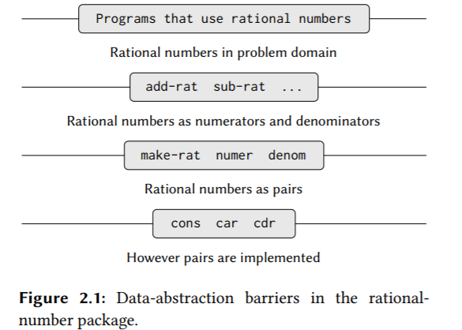
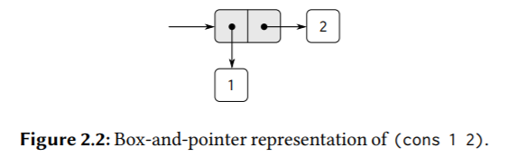
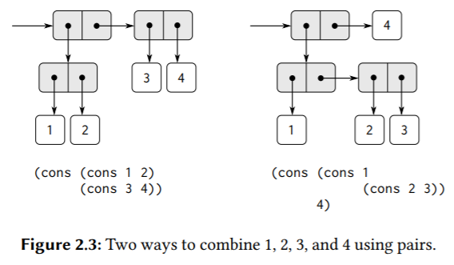
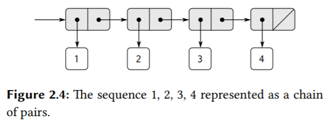
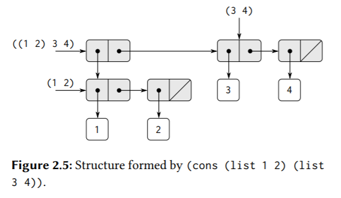
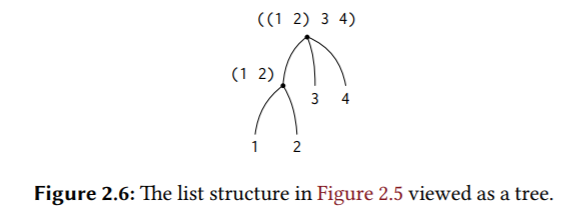
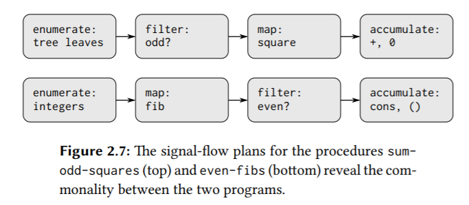

# 2 Building Abstractions with Data

Why do we want compound data in a programming language? For the same reasons that we want compound procedures: **to elevate the conceptual level at which we can design our programs, to increase the modularity of our designs, and to enhance the expressive power of our language. Just as the ability to define procedures enables us to deal with processes at a higher conceptual level than that of the primitive operations of the language, the ability to construct compound data objects enables us to deal with data at a higher conceptual level than that of the primitive data objects of the language.**

## 2.1 Introduction to Data Abstraction

### 2.1.1 Example: Arithmetic Operations for Rational Numbers

如果没有数据抽象，无法实现有理数的概念，只能用primitive data，那么有理数加法的程序大概如下：

```scheme
; 如果没有数据抽象：
(define (add-numerator n1 n2)
  (+ n1 n2))
(define (add-denominator d1 d2)
  (+ d1 d2))
```

假如现在要处理10各有理数，这样就有10各分子，10各分母，光是手动维护10个分子和10个分母的对应关系，就足以烦死我们了，而且写出来的程序一团糟，全是一些基本的概念，无法很快、直观地看出程序要表达什么。

> Exercise 2.1: Define a better version of make-rat that handles both positive and negative arguments. make-rat should normalize the sign so that if the rational number is positive, both the numerator and denominator are positive, and if the rational number is negative, only the numerator is negative.

```scheme
; (define (make-rat n d)
;   (let ((g (abs (gcd n d))))
;     (cond ((and (< n 0) (< d 0)) (cons (/ (- n) g) (/ (- d) g)))
;           ((and (> n 0) (< d 0)) (cons (/ (- n) g) (/ (- d) g)))
;           (else (cons (/ n g) (/ d g))))))
; 更简洁的实现，利用不论是题目中描述的哪种情况，共同点都是分母最终都为正，所以只要分母为负，就让分子分母同除一个负数，否则，同除一个正数。
(define (make-rat n d)
  (let ((g ((if (< d 0) - +) (abs (gcd n d)))))
    (cons (/ n g) (/ d g))))

(print-rat (make-rat 6 9)) ; 2/3 
(print-rat (make-rat -6 9)) ; -2/3 
(print-rat (make-rat 6 -9)) ; -2/3 
(print-rat (make-rat -6 -9)) ; 2/3
(print-rat (make-rat 1 -2)) ; -1/2
(print-rat (make-rat 6 -9)) ; -2/3
```

### 2.1.2 Abstraction Barriers



**In effect, procedures at each level are the interfaces that define the abstraction barriers and connect the different levels.**

**At each level, the barrier separates the programs (above) that use the data abstraction from the programs (below) that implement the data abstraction.** 

中心思想是建立层次化的系统，建立抽象屏障将细节隔离在底层，将细节与你所工作的高层环境隔离开，底层的细节、底层的思想都不重要，那是底层组件的实现者该操心的事，我们只需使用底层实现者暴露出的约定的接口、行为。而这些接口就组成了抽象屏障(abstraction barrier)，为客户屏蔽了底层细节，让客户可以在更高的抽象层级上工作，方便地使用更高级的概念表达想法。

### 2.1.3 What Is Meant by Data?

我们讨论某种数据类型是什么，其实并不讨论数据类型是怎么实现的，而是关心数据类型的行为，即使用者与实现者约定的关于数据类型的接口。对于一种数据类型，不管实现者怎么实现它，有多少种方式实现它，只要最终实现的数据类型表现出与使用者约定的接口一样的行为，这就是够了。

对于上面实现的rational number，它要满足的行为是：如果x是(make-rat n d)，那么(numer x)/(denom x) = n/d。

对于pair，它要满足的行为是：for any objects x and y, if z is (cons x y) then (car z) is x and (cdr z) is y.

下面是pair的一个实现，那么它确实是这样实现的吗？不知道，也无所谓，只要它表现出来的行为满足上面的接口即可。

```scheme
(define (cons x y)
  (define (dispatch m)
    (cond ((= m 0) x)
          ((= m 1) y)
          (else (error "Argument not 0 or 1: CONS" m))))
  dispatch)
(define (car z) (z 0))
(define (cdr z) (z 1))
```

> Exercise 2.6: Church numerals.

http://community.schemewiki.org/?sicp-ex-2.6

http://markmiyashita.com/cs61a/higher_order_functions/church_numerals/

## 2.2 Hierarchical Data and the Closure Property

下面这个图体现的就是pair这个数据结构。

**lisp中的pair具有闭包性质(closure)，它的元素不仅可以是数，还可以是pair。如果pair没有闭包性质的话，其实我们并不能用它构造出多么复杂的数据结构（如三维坐标、树、链表等）。**





### 2.2.1 Representing Sequences

下面这个图体现的就是**list，它是一个pair，cdr指向另一个list或指向nil(empty list)**。



```scheme
(cons 2 (cons 3 4)) ; (2 3 . 4)
(cons 2 (cons 3 (cons 4 nil))) ; (2 3 4)
; (cadr ⟨arg⟩) = (car (cdr ⟨arg⟩))

; lisp提供了一个构造链表的语法糖：
(list 2 3 4) ; 与(cons 2 (cons 3 (cons 4 nil)))等价。
```

对list的传统编程技术有：
1. “**cdring down**” the list.

   ```scheme
   (define (length items)
     (if (null? items)
         0
         (+ 1 (length (cdr items)))))
   
   (define (length-iter items)
     (define (iter items count)
       (if (null? items)
           count
           (iter (cdr items) (+ count 1))))
     (iter items 0))
   ```

2. “**cons up**” an answer list while cdring down a list.

   ```scheme
   (define (append list1 list2)
     (if (null? list1)
         list2
         (cons (car list1) (append (cdr list1) list2))))
   (append '(1 2 3) '(4 5 6))
   ```

> Exercise 2.18:

```scheme
; 用递归过程不好做，考虑迭代过程。
(define (reverse1 lst)
  (cond ((null? lst) nil)
        ((null? (cdr lst)) (cons (car lst) nil))
        (else (cons (reverse1 (cdr lst)) (car lst)))))

(reverse1 (list 1 4 9 16 25)) ; (((((25) . 16) . 9) . 4) . 1)

(define (reverse2 lst)
  (define (iter lst result)
    (if (null? lst)
        result
        (iter (cdr lst) (cons (car lst) result)))) ; 头插法。
  (iter lst nil))

(reverse2 (list 1 4 9 16 25)) ; (25 16 9 4 1)
```

> Exercise 2.20:

```scheme
; (define (f x y . z) ⟨body⟩)
; (f 1 2 3 4 5 6)
; then in the body of f, x will be 1, y will be 2, and z will be the list (3 4 5 6).

(define (even? x) (= (remainder x 2) 0))

(define (same-parity . lst)
  (define (filter x)
    (if (even? (car lst))
        (even? x)
        (not (even? x))))
  (define (iter lst)
    (cond ((null? lst) nil)
          ((filter (car lst)) (cons (car lst) (iter (cdr lst))))
          (else (iter (cdr lst)))))
  (iter lst))

; 更好的函数签名是：
; (define (same-parity first . rest)

(same-parity 1 2 3 4 5 6 7) ; (1 3 5 7)
(same-parity 2 3 4 5 6 7) ; (2 4 6)
```

#### Mapping over lists

```scheme
(define (scale-list items factor)
  (if (null? items)
      nil
      (cons (* (car items) factor)
            (scale-list (cdr items)
                        factor))))
(scale-list (list 1 2 3 4 5) 10)
```

提取出一个通用模式map：

```scheme
; 对输入list的每个元素应用proc，返回新的list。
(define (map proc items)
  (if (null? items)
      nil
      (cons (proc (car items))
            (map proc (cdr items))))) ; cons up when cdring down the list.
(map abs (list -10 2.5 -11.6 17))
(map (lambda (x) (* x x)) (list 1 2 3 4)) ; XXX map将list中每一个元素x映射为x^2。
(define (scale-list items factor)
  (map (lambda (x) (* x factor))
       items))
```

**map is an important construct, not only because it captures a common pattern, but because it establishes a higher level of abstraction in dealing with lists**. In the original definition of scale-list, the recursive structure of the program draws attention to the element-by-element processing of the list. Defining scale-list in terms of map suppresses that level of detail and emphasizes that scaling transforms a list of elements to a list of results. **The difference between the two definitions is not that the computer is performing a different process (it isn’t) but that we think about the process differently. In effect, map helps establish an abstraction barrier that isolates the implementation of procedures that transform lists from the details of how the elements of the list are extracted and combined.** Like the barriers shown in Figure 2.1, this abstraction gives us the flexibility to change the low-level details of how sequences are implemented, while preserving the conceptual framework of operations that transform sequences to sequences. Section 2.2.3 expands on this use of sequences as a framework for organizing programs.

> Exercise 2.23:

```scheme
(define (for-each proc lst)
  (cond ((null? lst) #t)
        (else (proc (car lst)) (for-each proc (cdr lst)))))

; 返回#t，不关心返回值，返回什么都行。
(for-each (lambda (x)
            (newline)
            (display x))
          (list 57 321 88))
```

### 2.2.2 Hierarchical Structures





Another way **to think of sequences whose elements are sequences is as trees. The elements of the sequence are the branches of the tree, and elements that are themselves sequences are subtrees.** Figure 2.6 shows the structure in Figure 2.5 viewed as a tree.（也就是**树的孩子-兄弟表示法**）

**子list是父list的一个元素，由一个指针指向。**

```scheme
(define (count-leaves x)
  (cond ((null? x) 0)
        ((not (pair? x)) 1)
        (else (+ (count-leaves (car x)) ; 递归处理第一棵子树的孩子子树。
                 (count-leaves (cdr x)))))) ; 同一层上的其它兄弟子树，可能会是nil，那么会返回0。
```

> Exercise 2.24: Suppose we evaluate the expression (list 1 (list 2 (list 3 4))). Give the result printed by the interpreter, the corresponding box-and-pointer structure, and the interpretation of this as a tree (as in Figure 2.6).

> Exercise 2.25: Give combinations of cars and cdrs that will pick 7 from each of the following lists:
>
> ```scheme
> (1 3 (5 7) 9)
> ((7))
> (1 (2 (3 (4 (5 (6 7))))))
> ```

> Exercise 2.26: Suppose we define x and y to be two lists:
>
> ```scheme
> (define x (list 1 2 3))
> (define y (list 4 5 6))
> ```
>
> What result is printed by the interpreter in response to evaluating each of the following expressions:
>
> ```scheme
> (append x y)
> (cons x y)
> (list x y)
> ```

对于以上三题，要回顾上面的图，这里有一个[可视化工具](https://code.cs61a.org/)。

> Exercise 2.27: Modify your reverse procedure of Exercise 2.18 to produce a deep-reverse procedure that takes a list as argument and returns as its value the list with its elements reversed and with all sublists deep-reversed as well.

```scheme
(define (reverse lst)
  (define (iter lst result)
    (if (null? lst)
        result
        (iter (cdr lst) (cons (car lst) result))))
  (iter lst nil))
; 对比上面，只需修改一处。
(define (deep-reverse tree)
  (define (iter tree result)
    (if (null? tree)
        result
        (iter (cdr tree) (cons (if (list? (car tree))
                                   (iter (car tree) nil) ; 递归先展开，XXX 嵌套的list是更上一级的list中的一个元素，由一个指针指向。
                                   (car tree))
                               result)))) ; 头插法。
  (iter tree nil))

(define x (list (list 1 2) (list 3 4)))
(deep-reverse x) ; ((4 3) (2 1))
```

> Exercise 2.28:

```scheme
; 迭代递归过程，关键在于递归先求值/展开，在每一层，总是先递归到最右边的兄弟子树，然后迭代向下，也就是从最右边、最底下的叶子开始，采用头插法来构造result。
(define (fringe tree)
  (define (iter tree result)
    (cond ((null? tree) result)
          ((not (pair? tree)) (cons tree result)) ; 如果tree不是pair，而是primitive expression，即叶子。
          (else (iter (car tree) (iter (cdr tree) result)))))
  (iter tree nil))

(define x (list (list 1 2) (list 3 4)))
(fringe x) ; (1 2 3 4)
(fringe (list x x)) ; (1 2 3 4 1 2 3 4)

; 之所以要用头插法，是因为nil比较不好处理，可以用append处理nil，这样程序也更清晰、简单一些。
; XXX 注意这里用append，和cons不同，append会把多层的list压平。
(define (fringe tree) 
  (cond ((null? tree) nil) 
        ((not (pair? tree)) (list tree)) 
        (else (append (fringe (car tree)) (fringe (cdr tree)))))) 
```

#### Mapping over trees

```scheme
(define (scale-tree tree factor)
  (cond ((null? tree) nil)
        ((not (pair? tree)) (* tree factor)) ; 当前子树是叶子，直接处理返回。
        (else (cons (scale-tree (car tree) factor) ; 当前子树的孩子也是一棵树，递归处理。XXX 子list是父list的一个元素，由一个指针指向，所以这里用cons是没问题的。
                    (scale-tree (cdr tree) factor))))) ; 递归处理水平方向上的下一个兄弟子树。
(scale-tree (list 1 (list 2 (list 3 4) 5) (list 6 7)) 10) ; (10 (20 (30 40) 50) (60 70))

; 使用map，map会对输入的list的每一个pair的car应用给定的操作进行转换，map隐藏了如何提取链表元素和重组链表元素的细节。
(define (scale-tree tree factor)
  (map (lambda (sub-tree)
       (if (pair? sub-tree) ; 当前子树是叶子，直接处理返回。
           (scale-tree sub-tree factor) ; 当前子树的孩子也是一棵树，递归处理。
           (* sub-tree factor)))
       tree))
```

> Exercise 2.31:

```scheme
(define (tree-map proc tree)
  (cond ((null? tree) nil)
        ((not (pair? tree)) (proc tree))
        (else (cons (tree-map proc (car tree))
                    (tree-map proc (cdr tree))))))
(define (square-tree tree) (tree-map square tree))
(square-tree
 (list 1
       (list 2 (list 3 4) 5)
       (list 6 7)))
```

> Exercise 2.32: We can represent a set as a list of distinct elements, and we can represent the set of all subsets of the set as a list of lists. For example, if the set is (1 2 3), then the set of all subsets is (() (3) (2) (2 3) (1) (1 3) (1 2) (1 2 3)).

```scheme
; 一个很6的程序。
; The set of all subsets of a given set is the union of:
; - the set of all subsets excluding the first number.
; - the set of all subsets excluding the first number, with the first number re-inserted into each subset.
(define (subsets s)
  (if (null? s)
      (list nil) ;; initially had nil, always got () back! 
      (let ((rest (subsets (cdr s))) ; XXX 递归先展开。
            (first (car s)))
        (append rest (map (lambda (x) (cons first x)) rest)))))
(subsets (list 1 2 3))
```

### 2.2.3 Sequences as Conventional Interfaces

```scheme
(define (sum-odd-squares tree)
  (cond ((null? tree) 0)
        ((not (pair? tree))
         (if (odd? tree) (square tree) 0))
        (else (+ (sum-odd-squares (car tree))
                 (sum-odd-squares (cdr tree))))))

(define (even-fibs n)
  (define (next k)
    (if (> k n)
        nil
        (let ((f (fib k)))
          (if (even? f)
              (cons f (next (+ k 1)))
              (next (+ k 1))))))
  (next 0))
```



#### Sequence Operations

The key to organizing programs so as to more clearly reflect the signal-flow structure is to concentrate on the “signals” that flow from one stage in the process to the next. **If we represent these signals as lists, then we can use list operations to implement the processing at each of the stages**.

```scheme
(define (square x) (* x x))
(define (odd? x) (= (remainder x 2) 1))

; primitive map
(map square (list 1 2 3 4 5))

(define (filter predicate sequence)
  (cond ((null? sequence) nil)
        ((predicate (car sequence))
         (cons (car sequence)
               (filter predicate (cdr sequence))))
        (else (filter predicate (cdr sequence)))))
(filter odd? (list 1 2 3 4 5))

; 注意这里的op限定为一个二元操作符，即接收两个参数。
; initial也就是遍历到sequence结束时，即遇到nil是要返回的值。
; "op up" when cdring down the list.
; 迭代版本其实就是把"op up"放在参数中。
(define (accumulate op initial sequence)
  (if (null? sequence)
      initial
      (op (car sequence)
          (accumulate op initial (cdr sequence)))))
(accumulate + 0 (list 1 2 3 4 5))
(accumulate * 1 (list 1 2 3 4 5))
(accumulate cons nil (list 1 2 3 4 5))

(define (enumerate-interval low high)
  (if (> low high)
      nil
      (cons low (enumerate-interval (+ low 1) high))))
(enumerate-interval 2 7)

(define (enumerate-tree tree)
  (cond ((null? tree) nil)
        ((not (pair? tree)) (list tree))
        (else (append (enumerate-tree (car tree)) ; 注意这里用append，和cons不同，append会把多层的list压平。
                      (enumerate-tree (cdr tree))))))
(enumerate-tree (list 1 (list 2 (list 3 4)) 5))
```

使用这些的高级抽象/模块/概念重新实现上面的两个procedure：

```scheme
(define (sum-odd-squares tree)
  (accumulate
   + 0 (map square (filter odd? (enumerate-tree tree)))))

(define (even-fibs n)
  (accumulate
   cons
   nil
   (filter even? (map fib (enumerate-interval 0 n)))))
```

We can also formulate conventional data-processing applications in terms of sequence operations. Suppose we have a sequence of personnel records and we want to find the salary of the highest-paid programmer. Assume that we have a selector salary that returns the salary of a record, and a predicate programmer? that tests if a record is for a programmer. Then we can write:

```scheme
(define (salary-of-highest-paid-programmer records)
  (accumulate max 0 (map salary (filter programmer? records))))
```

> Exercise 2.33:

```scheme
(define (map p sequence)
  (accumulate (lambda (x y) (cons (p x) y)) nil sequence))
(define (append seq1 seq2)
  (accumulate cons seq2 seq1))
(define (length sequence)
  (accumulate (lambda (x y) (+ 1 y)) 0 sequence))
(length '(1 2 3 4 5))
(append '(1 2 3) '(34))
(map square (list 1 2 3 4 5))
```

> Exercise 2.34:

```scheme
; a_nx^n + a_(n−1)x^(n−1) + ··· + a_1x + a_0
; a_0 + x(a_1 + ... + x(a_(n-1) + x(a_n)))
(define (horner-eval x coefficient-sequence)
  (accumulate (lambda (this-coeff higher-terms) (+ this-coeff (* x higher-terms)))
              0
              coefficient-sequence))
; 1+3x+5x^3+x^5 at x=2
(horner-eval 2 (list 1 3 0 5 0 1)) ; 79
```

> Exercise 2.35:

```scheme
(define (count-leaves1 t)
  (accumulate + 0 (map (lambda (t) 1) (enumerate-tree t))))
(define (count-leaves2 t)
  (accumulate + 0 (map (lambda (t) (if (not (pair? t))
                                       1 ; 如果链表中的当前元素是叶子，将该元素映射为1。
                                       (count-leaves2 t))) t))) ; 否则将该元素映射为(count-leaves2 t)。
(count-leaves1 (list (list 1 2) 3 (list 6 4)))
(count-leaves2 (list (list 1 2) 3 (list 6 4)))
```

> Exercise 2.36:

```scheme
; 这个程序太6了。
(define (accumulate-n op init seqs)
  (if (null? (car seqs))
      nil
      (cons (accumulate op init (map (lambda (s) (car s)) seqs)) ; 将seqs的每一个元素s，即链表s，映射为一个(car s)，然后对这个映射过来的新的list实施accumulate成一个单一的值。
            (accumulate-n op init (map (lambda (s) (cdr s)) seqs))))) ; 同理。
(accumulate-n + 0 (list (list 1 2 3) (list 4 5 6) (list 7 8 9) (list 10 11 12))) ; (22 26 30)
```

> Exercise 2.38: The accumulate procedure is also known as fold-right, because it combines the first element of the sequence with the result of combining all the elements to the right. There is also a fold-left, which is similar to foldright, except that it combines elements working in the opposite direction:

```scheme
(define (fold-right op initial sequence) 
  (if (null? sequence) 
      initial 
      (op (car sequence) 
          (fold-right op initial (cdr sequence)))))

(define (fold-left op initial sequence)
  (define (iter result rest)
    (if (null? rest)
        result
        (iter (op result (car rest))
              (cdr rest))))
  (iter initial sequence))
```

What are the values of

```scheme
(fold-right / 1 (list 1 2 3))
(fold-left / 1 (list 1 2 3))
(fold-right list nil (list 1 2 3))
(fold-left list nil (list 1 2 3))
```

Give a property that op should satisfy to guarantee that fold-right and fold-left will produce the same values for any sequence.

二元运算符应可交换。

> Exercise 2.39:

```scheme
(define (reverse sequence)
  (fold-right
   (lambda (first already-reversed) (append already-reversed (list first))) ; (list first)等价于(cons first nil)。
   nil
   sequence))
(define (reverse sequence)
  (fold-left
   (lambda (result first) (cons first result)) ; 头插法。
   nil
   sequence))
```

#### Nested Mappings

Consider this problem: Given a positive integer n, find all ordered pairs of distinct positive integers i and j, where 1 ≤ j < i ≤ n, such that i + j is prime.

下面的思路是先生成所有的组合(i, j)，然后filter选出合适的组合。

```scheme
(accumulate
 append nil (map (lambda (i)
                   (map (lambda (j) (list i j))
                        (enumerate-interval 1 (- i 1))))
                 (enumerate-interval 1 n))) ; enumerate-interval产生1-n的list，然后对这每一个元素，应用proc，这里的proc会把单一的元素i映射成一个新的元素为(list i j)的listX，最后用accumulate和append把这些listX连接起来，也就是把原来两层的list，压平为一层的list，元素为(list i j)。

; 这里抽象出一个flatmap，用于proc会把list中的单个元素映射成一个list，从而产生两层list的情况，flatmap会把这个两层list压平为一层list。
(define (flatmap proc seq)
  (accumulate append nil (map proc seq)))
```

```scheme
(define (prime-sum? pair)
  (prime? (+ (car pair) (cadr pair))))

(define (make-pair-sum pair)
  (list (car pair) (cadr pair) (+ (car pair) (cadr pair))))

(define (prime-sum-pairs n)
  (map make-pair-sum
       (filter prime-sum? (flatmap
                           (lambda (i)
                             (map (lambda (j) (list i j))
                                  (enumerate-interval 1 (- i 1)))) ; 关注这个映射函数，将值i映射为一个list。
                           (enumerate-interval 1 n)))))
```

Suppose we wish to generate all the permutations of a set S; that is, all the ways of ordering the items in the set. For instance, the permutations of {1, 2, 3} are {1, 2, 3}, {1, 3, 2}, {2, 1, 3}, {2, 3, 1}, {3, 1, 2}, and {3, 2, 1}. 

如{1, 2, 3}，递归到{2, 3}，然后又有两条分支，{3}和{2}，即去掉2和去掉3，返回后又会展开到其它分支，如{2, 3}和{1, 2}。

```scheme
(define (permutations s)
  (if (null? s) ; empty set?
      (list nil) ; sequence containing empty set
      (flatmap (lambda (x) ; 该映射函数会将s中每一个元素x映射为一个list，然后再由accumulate和append“压平”双层list。
                 (map (lambda (p) (cons x p)) ; 该映射函数会将list中的元素p映射为(cons x p)。
                      (permutations (remove x s))))
               s)))

(define (remove item seq)
  (filter (lambda (x) (not (= item x))) seq))
```

> Exercise 2.40: Define a procedure unique-pairs that, given an integer n, generates the sequence of pairs (i, j) with 1 ≤ j < i ≤ n. Use unique-pairs to simplify the definition of prime-sum-pairs given above.

```scheme
(define (unique-pairs n)
  (flatmap (lambda (i)
             (map (lambda (j) (list j i))
                  (enumerate-interval 1 (- i 1)))) (enumerate-interval 1 n)))
(unique-pairs 5) ; ((1 2) (1 3) (2 3) (1 4) (2 4) (3 4) (1 5) (2 5) (3 5) (4 5))
```

> Exercise 2.41:

```scheme
(define (get-triples n)
  (flatmap
   (lambda (i)
     (flatmap
      (lambda (j)
        (map
         (lambda (k) (list i j k))
         (enumerate-interval (+ j 1) n)))
      (enumerate-interval (+ i 1) n)))
   (enumerate-interval 1 n)))

; (get-triples 4)

(define (sum seq)
  (accumulate + 0 seq))

(define (s-triple n s)
  (filter (lambda (triple) (= (sum triple) s))
          (get-triples n)))

(s-triple 8 19)
```

> Exercise 2.42: N皇后问题。

```scheme
(define empty-board nil)

(define (adjoin-position row col seq)
  (append (list row) seq)) ; 因为我的empty-board定义为nil，所以这里不采用(append seq (list row))。

(define (safe? k positions) ; 第k列。
  (define row-of-k (car positions)) ; 第k列上queen放置的行号。
  (define (iter cur-col positions)
    (let ((distance (- cur-col 1)))
      (cond ((null? positions) #t)
            ((= row-of-k (car positions)) #f) ; 行号相等。
            ((or (= row-of-k (+ (car positions) distance)) ; 在对角线上。
                 (= row-of-k (- (car positions) distance)))
             #f)
			; 不需要检查列号，因为我们就是逐列放置皇后的，列号必定不相等。
            (else (iter (+ cur-col 1) (cdr positions))))))
  (iter 2 (cdr positions)))

(define (queens board-size)
  (define (queen-cols k)
    (if (= k 0)
        (list empty-board)
        (filter
         (lambda (positions) (safe? k positions))
         (flatmap
          (lambda (rest-of-queens) ; 将元素list映射为list。
            (map (lambda (new-row)
                   (adjoin-position
                    new-row k rest-of-queens))
                 (enumerate-interval 1 board-size)))  ; 遍历行。
          (queen-cols (- k 1)))))) ; 返回一个list，元素为list。
  (queen-cols board-size))

(queens 8)
```

> Exercise 2.43: Louis Reasoner is having a terrible time doing Exercise 2.42. His queens procedure seems to work, but it runs extremely slowly. (Louis never does manage to wait long enough for it to solve even the 6 × 6 case.) When Louis asks Eva Lu Ator for help, she points out that he has interchanged the order of the nested mappings in the flatmap, writing it as
>
> ```scheme
> (flatmap
>  (lambda (new-row)
>    (map (lambda (rest-of-queens)
>           (adjoin-position new-row k rest-of-queens))
>         (queen-cols (- k 1))))
>  (enumerate-interval 1 board-size))
> ```
>
> Explain why this interchange makes the program run slowly. Estimate how long it will take Louis’s program to solve the eight-queens puzzle, assuming that the program in Exercise 2.42 solves the puzzle in time T.

虽然我无法明确提出一个准确的时间复杂度，但表面上看，2.43的算法中，比如k=5，那么(queen-cols 4)会被应用board-size次，而2.42的算法只需一次，对比之下，2.43的算法多了大量无意义的重复计算。

### 2.2.4 Example: A Picture Language

## 2.3 Symbolic Data

