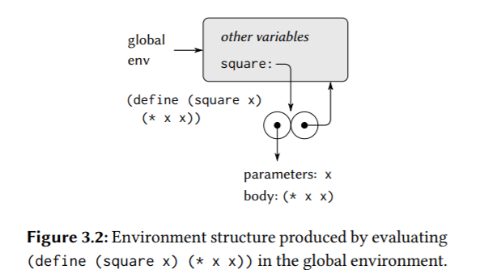
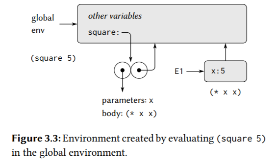
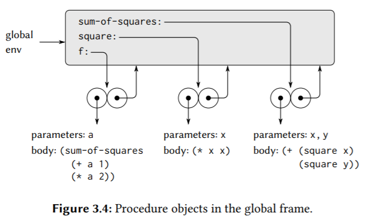
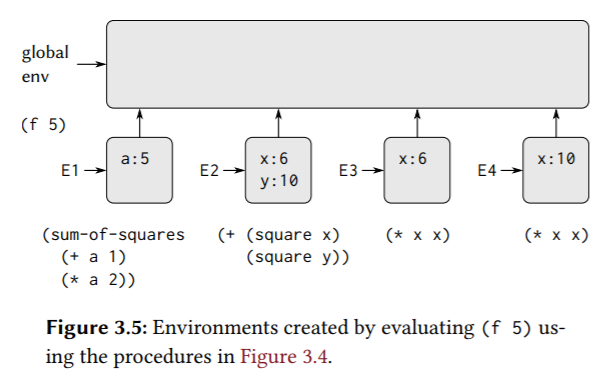
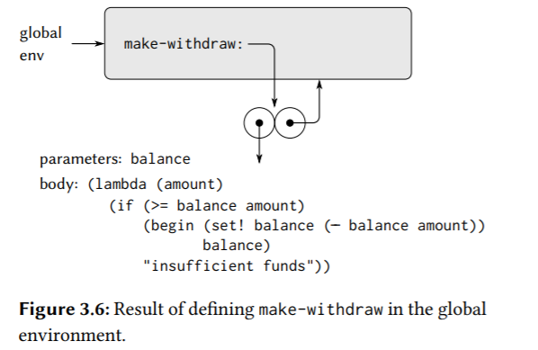
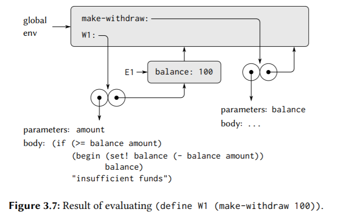
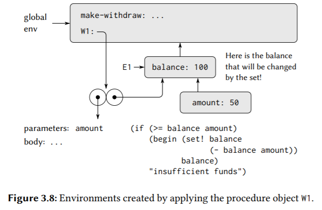
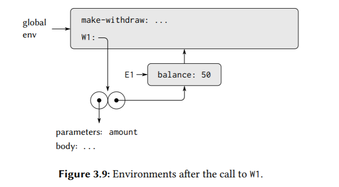
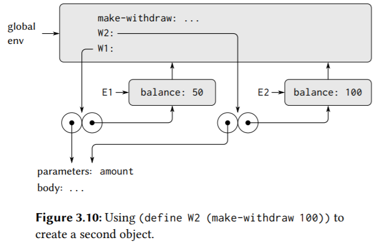
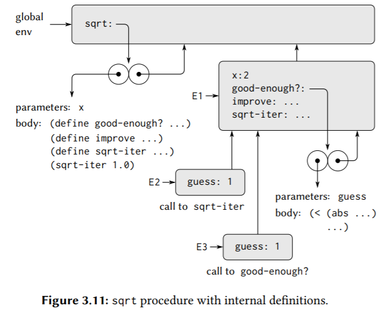

# 3 Modularity, Objects, and State

## 3.1 Assignment and Local State

### 3.1.1 Local State Variables

```scheme
; Exercise 3.1:
(define (make-accumulator sum)
  (lambda (x) (begin (set! sum (+ sum x)) sum)))
(define A (make-accumulator 5))
(A 10) ; 15
(A 15) ; 30

; Exercise 3.2:
(define (make-monitored f)
  (let ((count 0))
    (lambda (first . rest)
      (if (eq? first 'how-many-calls?)
          count
          (begin (set! count (+ count 1)) (apply f (cons first rest)))))))

(define s (make-monitored sqrt))
(s 100) ; 10
(s 4) ; 2
(s 'how-many-calls?) ; 2

; Exercise 3.3:
(define (make-account balance password)
  (define (withdraw amount)
    (if (>= balance amount)
        (begin (set! balance (- balance amount))
               balance)
        "Insufficient funds"))
  (define (deposit amount)
    (set! balance (+ balance amount))
    balance)
  (define (dispatch pwd m)
    (cond ((not (eq? pwd password)) (lambda (amount) (display "Incorrect password") (newline)))
          ((eq? m 'withdraw) withdraw)
          ((eq? m 'deposit) deposit)
          (else (error "Unknown request: MAKE-ACCOUNT"
                       m))))
  dispatch)

(define acc (make-account 100 'secret-password))
((acc 'secret-password 'withdraw) 40)
((acc 'some-other-password 'deposit) 50)

; Exercise 3.4:
(define (make-account-2 balance password)
  (define consecutive-password-mismatch 0)
  (define (call-the-cops) (lambda (amount) (display "Cops called!") (newline)))
  (define (withdraw amount)
    (if (>= balance amount)
        (begin (set! balance (- balance amount))
               balance)
        "Insufficient funds"))
  (define (deposit amount)
    (set! balance (+ balance amount))
    balance)
  (define (dispatch pwd m)
    (cond ((not (eq? pwd password)) (begin
                                      (set! consecutive-password-mismatch (+ consecutive-password-mismatch 1))
                                      (if (> consecutive-password-mismatch 3) ; 这里方便测试设置为3次。
                                          (call-the-cops)
                                          (lambda (amount) (display "Incorrect password") (newline)))))
          ((eq? m 'withdraw) (begin (set! consecutive-password-mismatch 0) withdraw))
          ((eq? m 'deposit) (begin (set! consecutive-password-mismatch 0) deposit))
          (else (error "Unknown request: MAKE-ACCOUNT"
                       m))))
  dispatch)

(define acc-2 (make-account-2 100 'secret-password))
((acc-2 'some-other-password 'deposit) 50)
((acc-2 'secret-password 'withdraw) 40)
((acc-2 'some-other-password 'deposit) 50)
((acc-2 'some-other-password 'deposit) 50)
((acc-2 'some-other-password 'deposit) 50)
((acc-2 'some-other-password 'deposit) 50)
```

### 3.1.2 The Benefits of Introducing Assignment

```scheme
(define (estimate-pi trials)
  (sqrt (/ 6 (monte-carlo trials cesaro-test))))
(define (cesaro-test)
  (= (gcd (rand) (rand)) 1))
(define (monte-carlo trials experiment)
  (define (iter trials-remaining trials-passed)
    (cond ((= trials-remaining 0)
           (/ trials-passed trials))
          ((experiment)
           (iter (- trials-remaining 1)
                 (+ trials-passed 1)))
          (else
           (iter (- trials-remaining 1)
                 trials-passed))))
  (iter trials 0))

; 如果没有使用赋值来更新内部状态的话，求破坏了随机数生成器的模块性。
(define (estimate-pi trials)
  (sqrt (/ 6 (random-gcd-test trials random-init))))
(define (random-gcd-test trials initial-x)
  (define (iter trials-remaining trials-passed x)
    (let ((x1 (rand-update x)))
      (let ((x2 (rand-update x1)))
        (cond ((= trials-remaining 0)
               (/ trials-passed trials))
              ((= (gcd x1 x2) 1)
               (iter (- trials-remaining 1)
                     (+ trials-passed 1)
                     x2))
              (else
               (iter (- trials-remaining 1)
                     trials-passed
                     x2))))))
  (iter trials 0 initial-x))
```

The general phenomenon illustrated by the Monte Carlo example is this: From the point of view of one part of a complex process, the other parts appear to change with time. They have hidden time-varying local state. If we wish to write computer programs whose structure reflects this decomposition, we make computational objects (such as bank accounts and random-number generators) whose behavior changes with time. **We model state with local state variables, and we model the changes of state with assignments to those variables.** It is tempting to conclude this discussion by saying that, **by introducing assignment and the technique of hiding state in local variables, we are able to structure systems in a more modular fashion than if all state had to be manipulated explicitly, by passing additional parameters.** Unfortunately, as we shall see, the story is not so simple.

### 3.1.3 The Costs of Introducing Assignment

So long as we do not use assignments, two evaluations of the same procedure with the same arguments will produce the same result, so that procedures can be viewed as computing mathematical functions. Programming without any use of assignments, as we did throughout the first two chapters of this book, is accordingly known as `functional programming`.

A language that supports the concept that “equals can be substituted for equals” in an expression without changing the value of the expression is said to be referentially transparent. Referential transparency is violated when we include set! in our computer language. This makes it tricky to determine when we can simplify expressions by substituting equivalent expressions. Consequently, reasoning about programs that use assignment becomes drastically more difficult.

我们之前说的相等是两个对象，值相等（两个有理数）或两个过程相等，即行为、功能相同，接收同样的参数、总是产出同样的值。引入赋值后，相等也可以是同一个对象，在不同状态时也是相等的（一个存款会变化的银行账户）。

In contrast to functional programming, programming that makes extensive use of assignment is known as imperative programming. In addition to raising complications about computational models, programs written in imperative style are susceptible to bugs that cannot occur in functional programs.

In general, programming with assignment forces us to carefully consider the relative orders of the assignments to make sure that each statement is using the correct version of the variables that have been changed. This issue simply does not arise in functional programs.

The complexity of imperative programs becomes even worse if we consider applications in which several processes execute concurrently.

> Exercise 3.8: When we defined the evaluation model in Section 1.1.3, we said that the first step in evaluating an expression is to evaluate its subexpressions. But we never specified the order in which the subexpressions should be evaluated (e.g., left to right or right to left). When we introduce assignment, the order in which the arguments to a procedure are evaluated can make a difference to the result. Define a simple procedure f such that evaluating `(+ (f 0) (f 1))` will return 0 if the arguments to + are evaluated from left to right but will return 1 if the arguments are evaluated from right to left.

```scheme
; 比如一个累乘的程序。
(define f 
  (let ((count 1)) 
    (lambda (x)  
      (set! count (* count x)) 
      count)))
```

## 3.2 The Environment Model of Evaluation

### 3.2.1 The Rules for Evaluation

the presence of assignment, a variable can no longer be considered to be merely a name for a value. Rather, **a variable must somehow designate a “place” in which values can be stored.** In our new model of evaluation, these places will be maintained in structures called environments.

An environment is a sequence of frames. Each frame is a table (possibly empty) of bindings, which associate variable names with their corresponding values. (A single frame may contain at most one binding for any variable.) Each frame also has a pointer to its enclosing environment, unless, for the purposes of discussion, the frame is considered to be global. The value of a variable with respect to an environment is the value given by the binding of the variable in the first frame in the environment that contains a binding for that variable. If no frame in the sequence specifies a binding for the variable, then the variable is said to be unbound in the environment.

The environment is crucial to the evaluation process, because it determines the context in which an expression should be evaluated. an expression acquires a meaning only with respect to some environment in which it is evaluated.

The environment model of procedure application can be summarized by two rules:

- A procedure is created by evaluating a λ-expression relative to a given environment. The resulting procedure object is a pair consisting of the text of the λ-expression and a pointer to the environment in which the procedure was created.
  

- A procedure object is applied to a set of arguments by constructing a frame, binding the formal parameters of the procedure to the arguments of the call, and then evaluating the body of the procedure in the context of the new environment constructed.
  The new frame has (as its enclosing environment) (the environment part of the procedure object being applied).（倒装句式？）
  

We also specify that defining a symbol using define creates a binding in the current environment frame and assigns to the symbol the indicated value. Finally, we specify the behavior of set!, the operation that forced us to introduce the environment model in the first place. Evaluating the expression `(set! <variable> <value>)` in some environment locates the binding of the variable in the environment and changes that binding to indicate the new value. That is, one finds the first frame in the environment that contains a binding for the variable and modifies that frame. If the variable is unbound in the environment, then set! signals an error

### 3.2.2 Applying Simple Procedures

> Exercise 3.9:

http://community.schemewiki.org/?sicp-ex-3.9





### 3.2.3 Frames as the Repository of Local State











Exercise 3.10:
http://community.schemewiki.org/?sicp-ex-3.10

### 3.2.4 Internal Definitions



这就是为什么内部定义的过程可以使用外部过程的变量，如形参，因为内部过程在外部过程调用的frameA中被求值，创建实体对象，这些对象的第二个部分指向该frameA，当它们被调用时，它们会创建自己的frame，指向frameA，可以通过往上查找找到在frameA中的变量。

The environment model thus explains the two key properties that make local procedure definitions a useful technique for modularizing programs:
- The names of the local procedures do not interfere with names external to the enclosing procedure, because the local procedure names will be bound in the frame that the procedure creates when it is run, rather than being bound in the global environment.
- The local procedures can access the arguments of the enclosing procedure, simply by using parameter names **as free variables**（对于内部过程来说是自由变量）. This is because the body of the local procedure is evaluated in an environment that is subordinate to the evaluation environment for the enclosing procedure.

> Exercise 3.11:

http://community.schemewiki.org/?sicp-ex-3.11

## 3.3 Modeling with Mutable Data

### 3.3.1 Mutable List Structure

#### Sharing and identity

In general, sharing is completely undetectable if we operate on lists using only cons, car, and cdr. However, if we allow mutators on list structure, sharing becomes significant. 因为修改了共享的数据，那么其它使用该共享数据的对象如果没有被显式通知，那么就会做出错误的行为。

cons会创建一个新的pair，并返回指向这个pair的指针。

(eq? x y) tests whether x and y are the same object (that is, whether x and y are equal as pointers). 即如果两个变量指向同一块存储区域，那就返回#t。

```scheme
(memq '(1 2) '((1 2) (1 2) 3))
(define a '(1 2)) ; #f
(memq a (list a 2 3)) ; ((1 2) 2 3)
(memq a '(a 2 3)) ; #f
```

memq测试给定的对象是否是一个list的元素，q表示使用的是eq。

> Exercise 3.16:

http://community.schemewiki.org/?sicp-ex-3.16

```scheme
; Exercise 3.17:
(define (count-pairs x) 
  (let ((encountered '())) 
    (define (helper x) 
      (if (or (not (pair? x)) (memq x encountered)) 
          0 
          (begin 
            (set! encountered (cons x encountered)) 
            (+ (helper (car x)) 
               (helper (cdr x)) 
               1)))) 
    (helper x)))

; Exercise 3.18:
; http://community.schemewiki.org/?sicp-ex-3.18
(define (cycle? x) 
  (define visited nil) 
  (define (iter x) 
    (set! visited (cons x visited))  ; 注意，这里是创建了一个pair，弄一个指针指向x指向的对象。没有创建x指向的对象的副本。
    (cond ((null? (cdr x)) false) 
          ((memq (cdr x) visited) true) 
          (else (iter (cdr x))))) 
  (iter x))
  
; Exercise 3.19:
; TODO
```

#### Mutation is just assignment

### 3.3.2 Representing queues

## 3.4 Concurrency: Time Is of the Essence

