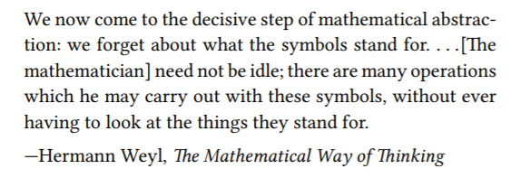

# 2 Building Abstractions with Data



Programs are typically designed to model complex phenomena, and more often than not one（往往、常常） must construct computational objects that have several parts in order to model real-world phenomena that have several aspects. Thus, whereas our focus in chapter 1 was on building abstractions by combining procedures to form compound procedures, we turn in this chapter to another key aspect of any programming language: the means it provides for building abstractions by combining data objects to form compound data.

Why do we want compound data in a programming language? For the same reasons that we want compound procedures: **to elevate the conceptual level at which we can design our programs, to increase the modularity of our designs, and to enhance the expressive power of our language. Just as the ability to define procedures enables us to deal with processes at a higher conceptual level than that of（高于） the primitive operations of the language, the ability to construct compound data objects enables us to deal with data at a higher conceptual level than that of the primitive data objects of the language.**

## 2.1 Introduction to Data Abstraction

**The basic idea of data abstraction is to structure the programs that are to use compound data objects so that they operate on “abstract data.” That is, our programs should use data in such a way as to make no assumptions about the data that are not strictly necessary for performing the task at hand.**

### 2.1.1 Example: Arithmetic Operations for Rational Numbers

```scheme
; 如果没有数据抽象：
(define (add-numerator n1 n2)
  (+ n1 n2))
(define (add-denominator d1 d2)
  (+ d1 d2))

(define (gcd a b)
  (if (= b 0) ; 当b或r为0时返回a。
      a
      (gcd b (remainder a b))))

; (define (make-rat n d) (cons n d))
(define (make-rat n d)
  (let ((g (abs (gcd n d))))
    (cons (/ n g) (/ d g)))) ; 也可以在selector中进行reduce。
(define (numer x) (car x))
(define (denom x) (cdr x))

; (define make-rat cons)
; (define numer car)
; (define denom cdr)

(define (add-rat x y)
  (make-rat (+ (* (numer x) (denom y))
               (* (numer y) (denom x)))
            (* (denom x) (denom y))))
(define (sub-rat x y)
  (make-rat (- (* (numer x) (denom y))
               (* (numer y) (denom x)))
            (* (denom x) (denom y))))
(define (mul-rat x y)
  (make-rat (* (numer x) (numer y))
            (* (denom x) (denom y))))
(define (div-rat x y)
  (make-rat (* (numer x) (denom y))
            (* (denom x) (numer y))))
(define (equal-rat? x y)
  (= (* (numer x) (denom y))
     (* (numer y) (denom x))))

(define (print-rat x)
  (newline)
  (display (numer x))
  (display "/")
  (display (denom x)))

(define one-third (make-rat 1 3))
(define one-half (make-rat 1 6))
(print-rat (add-rat one-third one-half)) ; 1/2
```

> Exercise 2.1: Define a better version of make-rat that handles both positive and negative arguments. make-rat should normalize the sign so that if the rational number is positive, both the numerator and denominator are positive, and if the rational number is negative, only the numerator is negative.

```scheme
; (define (make-rat n d)
;   (let ((g (abs (gcd n d))))
;     (cond ((and (< n 0) (< d 0)) (cons (/ (- n) g) (/ (- d) g)))
;           ((and (> n 0) (< d 0)) (cons (/ (- n) g) (/ (- d) g)))
;           (else (cons (/ n g) (/ d g))))))
; 更简洁的实现，利用不论是题目中描述的哪种情况，共同点都是分母最终都为正，所以只要分母为负，就让分子分母同除一个负数，否则，同除一个正数。
(define (make-rat n d)
  (let ((g ((if (< d 0) - +) (abs (gcd n d)))))
    (cons (/ n g) (/ d g))))

(print-rat (make-rat 6 9)) ; 2/3 
(print-rat (make-rat -6 9)) ; -2/3 
(print-rat (make-rat 6 -9)) ; -2/3 
(print-rat (make-rat -6 -9)) ; 2/3
(print-rat (make-rat 1 -2)) ; -1/2
(print-rat (make-rat 6 -9)) ; -2/3
```

### 2.1.2 Abstraction Barriers


**In effect, procedures at each level are the interfaces that define the abstraction barriers and connect the different levels.**

**At each level, the barrier separates the programs (above) that use the data abstraction from the programs (below) that implement the data abstraction.** 

**某一层使用与之相邻的下层提高的服务/接口来实现本层对上层提供的服务/接口。**。

> Exercise 2.2:

```scheme
;; ex 2.2.  Straightforward 
  
;; Point 
(define (make-point x y) (cons x y)) 
(define (x-point p) (car p)) 
(define (y-point p) (cdr p)) 
(define (print-point p) 
  (newline) 
  (display "(") 
  (display (x-point p)) 
  (display ",") 
  (display (y-point p)) 
  (display ")")) 
 
;; Segment 
(define (make-segment start-point end-point) 
  (cons start-point end-point)) 
(define (segment-start segment) (car segment)) 
(define (segment-end segment) (cdr segment)) 
 
(define (midpoint-segment segment) 
  (define (average a b) (/ (+ a b) 2.0)) 
  (let ((a (segment-start segment)) 
        (b (segment-end segment))) 
    (make-point (average (x-point a) 
                         (x-point b)) 
                (average (y-point a) 
                         (y-point b))))) 
 
;; Testing 
(define seg (make-segment (make-point 2 3) 
                          (make-point 10 15))) 
 
(print-point (midpoint-segment seg)) 
```

lackita: **I think the above solution misses part of the point about abstraction barriers; midpoint-segment reaches through both layers to achieve its goal.**

```scheme
(define (average-points a b) 
  (make-point (average (x-point a) (x-point b)) 
              (average (y-point a) (y-point b)))) 
 
(define (midpoint-segment seg) 
  (average-points (segment-start seg)
                  (segment-end seg)))
```

> Exercise 2.3: Implement a representation for rectangles in a plane. 

http://community.schemewiki.org/?sicp-ex-2.3

### 2.1.3 What Is Meant by Data?

In general, we can think of data as defined by some collection of selectors and constructors, together with specified conditions that these procedures must fulfill in order to be a valid representation.

对于上面实现的rational number，它的ctor和selector要满足的条件是：如果x是(make-rat n d)，那么(numer x)/(denom x) = n/d。

对于pair，它的ctor和selector要满足的条件是：for any objects x and y, if z is (cons x y) then (car z) is x and (cdr z) is y.

说到底，就是在数据类型的ctor和selector或其它相关的procedure构造的抽象屏障上，我们只需关心该数据类型的行为、功能是什么以及怎么使用。至于该数据类型是怎么实现的，客户并不需要关心。**客户只需要在这些抽象屏障上，在更高的概念层级上，在数据抽象和过程抽象赋予语言的更强的表达能力上，更好、更方便地构建程序即可**。

下面是pair的一个实现，那么它确实是这样实现的吗？不知道，也无所谓，只要它表现出来的行为满足上面的条件即可。

```scheme
(define (cons x y)
  (define (dispatch m)
    (cond ((= m 0) x)
          ((= m 1) y)
          (else (error "Argument not 0 or 1: CONS" m))))
  dispatch)
(define (car z) (z 0))
(define (cdr z) (z 1))
```

> Exercise 2.4:

```scheme
(define (cons x y)
  (lambda (m) (m x y)))
(define (car z)
  (z (lambda (p q) p)))
; 在这种pair实现中，cdr的实现如下。
(define (cdr z)
  (z (lambda (p q) q)))
```

> Exercise 2.6: Church numerals.

http://community.schemewiki.org/?sicp-ex-2.6

http://markmiyashita.com/cs61a/higher_order_functions/church_numerals/

### 2.1.4 Extended Exercise: Interval Arithmetic

TODO

