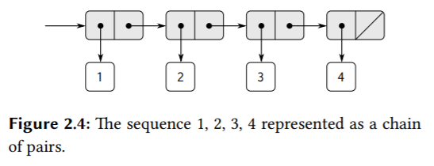
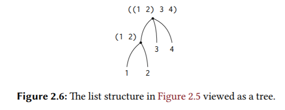
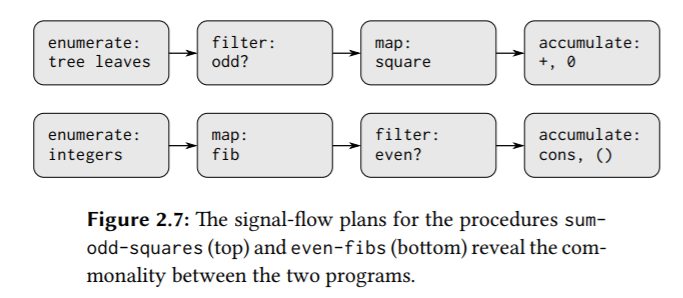

## 2.2 Hierarchical Data and the Closure Property!

下面这个图体现的就是pair这个数据结构。


### 2.2.1 Representing Sequences

下面这个图体现的就是**list，它是一个pair，cdr指向另一个list或指向nil(empty list)**。



```scheme
(cons 2 (cons 3 4)) ; (2 3 . 4)
(cons 2 (cons 3 (cons 4 nil))) ; (2 3 4)
; (cadr ⟨arg⟩) = (car (cdr ⟨arg⟩))
```

对list的传统编程技术有：
1. “**cdring down**” the list.

   ```scheme
   (define (length items)
     (if (null? items)
         0
         (+ 1 (length (cdr items)))))
   
   (define (length-iter items)
     (define (iter items count)
       (if (null? items)
           count
           (iter (cdr items) (+ count 1))))
     (iter items 0))
   ```

2. “**cons up**” an answer list while cdring down a list.

   ```scheme
   (define (append list1 list2)
     (if (null? list1)
         list2
         (cons (car list1) (append (cdr list1) list2))))
   (append '(1 2 3) '(4 5 6))
   ```

> Exercise 2.17:

```scheme
; returns the list that contains only the last element of a given (nonempty) list
(define (last-pair lst)
  (if (null? (cdr lst))
      lst
      (last-pair (cdr lst))))

(last-pair (list 23 72 149 34)) ; (34)
```

> Exercise 2.18:

```scheme
; 用递归过程不好做，考虑迭代过程。
(define (reverse1 lst)
  (cond ((null? lst) nil)
        ((null? (cdr lst)) (cons (car lst) nil))
        (else (cons (reverse1 (cdr lst)) (car lst)))))

(reverse1 (list 1 4 9 16 25)) ; (((((25) . 16) . 9) . 4) . 1)

(define (reverse2 lst)
  (define (iter lst result)
    (if (null? lst)
        result
        (iter (cdr lst) (cons (car lst) result))))
  (iter lst nil))

(reverse2 (list 1 4 9 16 25)) ; (25 16 9 4 1)
```

> Exercise 2.19:

```scheme
; For the last part of the exercise. The order of the coins does not affect the result. **Becuase the procedure computes all possible combinations.** But it does affect the speed of the computation. If you start with the lower valued coins, it'll take much longer.
(define (no-more? lst) (null? lst))
(define (except-first-denomination lst) (cdr lst))
(define (first-denomination lst) (car lst))

(define (cc amount coin-values)
  (cond ((= amount 0) 1) ; 恰好零钱换到0，即这是一条有效的路径，即这是一种有效的兑换零钱的方式，故返回1。
        ((or (< amount 0) (no-more? coin-values)) 0)
        (else
         (+ (cc amount
                (except-first-denomination
                 coin-values))
            (cc (- amount
                   (first-denomination
                    coin-values))
                coin-values)))))

(define us-coins (list 50 25 10 5 1))
(define uk-coins (list 100 50 20 10 5 2 1 0.5))

(cc 100 us-coins)

(define (timed-cc amount coin-values start-time) 
  (cc amount coin-values) 
  (- (runtime) start-time))
(timed-cc 200 us-coins (runtime))       ;19518
(timed-cc 200 (reverse2 us-coins) (runtime)) ;39055
```

> Exercise 2.20:

```scheme
; (define (f x y . z) ⟨body⟩)
; (f 1 2 3 4 5 6)
; then in the body of f, x will be 1, y will be 2, and z will be the list (3 4 5 6).

(define (even? x) (= (remainder x 2) 0))

(define (same-parity . lst)
  (define (filter x)
    (if (even? (car lst))
        (even? x)
        (not (even? x))))
  (define (iter lst)
    (cond ((null? lst) nil)
          ((filter (car lst)) (cons (car lst) (iter (cdr lst))))
          (else (iter (cdr lst)))))
  (iter lst))

; 更好的函数签名是：
; (define (same-parity first . rest)

(same-parity 1 2 3 4 5 6 7) ; (1 3 5 7)
(same-parity 2 3 4 5 6 7) ; (2 4 6)
```

#### Mapping over lists

```scheme
(define (scale-list items factor)
  (if (null? items)
      nil
      (cons (* (car items) factor)
            (scale-list (cdr items)
                        factor))))
(scale-list (list 1 2 3 4 5) 10)
```

提取出一个通用模式map：

```scheme
; 对输入list的每个元素应用proc，返回新的list。
(define (map proc items)
  (if (null? items)
      nil
      (cons (proc (car items))
            (map proc (cdr items))))) ; cons up when cdring down the list.
(map abs (list -10 2.5 -11.6 17))
(map (lambda (x) (* x x)) (list 1 2 3 4)) ; XXX map将list中每一个元素x映射为x^2。
(define (scale-list items factor)
  (map (lambda (x) (* x factor))
       items))
```

**map is an important construct, not only because it captures a common pattern, but because it establishes a higher level of abstraction in dealing with lists**. In the original definition of scale-list, the recursive structure of the program draws attention to the element-by-element processing of the list. Defining scale-list in terms of map suppresses that level of detail and emphasizes that scaling transforms a list of elements to a list of results. **The difference between the two definitions is not that the computer is performing a different process (it isn’t) but that we think about the process differently. In effect, map helps establish an abstraction barrier that isolates the implementation of procedures that transform lists from the details of how the elements of the list are extracted and combined.** Like the barriers shown in Figure 2.1, this abstraction gives us the flexibility to change the low-level details of how sequences are implemented, while preserving the conceptual framework of operations that transform sequences to sequences. Section 2.2.3 expands on this use of sequences as a framework for organizing programs.

> Exercise 2.23:

```scheme
(define (for-each proc lst)
  (cond ((null? lst) #t)
        (else (proc (car lst)) (for-each proc (cdr lst)))))

; 返回#t，不关心返回值，返回什么都行。
(for-each (lambda (x)
            (newline)
            (display x))
          (list 57 321 88))
```

### 2.2.2 Hierarchical Structures




Another way **to think of sequences whose elements are sequences is as trees. The elements of the sequence are the branches of the tree, and elements that are themselves sequences are subtrees.** Figure 2.6 shows the structure in Figure 2.5 viewed as a tree.（也就是**树的孩子-兄弟表示法**）

**子list是父list的一个元素**。

```scheme
(define (count-leaves x)
  (cond ((null? x) 0)
        ((not (pair? x)) 1)
        (else (+ (count-leaves (car x)) ; 第一棵子树的孩子子树。
                 (count-leaves (cdr x)))))) ; 同一层上的其它兄弟子树，可能会是nil，那么会返回0。
```

> Exercise 2.24: Suppose we evaluate the expression (list 1 (list 2 (list 3 4))). Give the result printed by the interpreter, the corresponding box-and-pointer structure, and the interpretation of this as a tree (as in Figure 2.6).

> Exercise 2.25: Give combinations of cars and cdrs that will pick 7 from each of the following lists:
>
> ```scheme
> (1 3 (5 7) 9)
> ((7))
> (1 (2 (3 (4 (5 (6 7))))))
> ```

> Exercise 2.26: Suppose we define x and y to be two lists:
>
> ```scheme
> (define x (list 1 2 3))
> (define y (list 4 5 6))
> ```
>
> What result is printed by the interpreter in response to evaluating each of the following expressions:
>
> ```scheme
> (append x y)
> (cons x y)
> (list x y)
> ```

对于以上三题，要回顾上面的图，这里有一个[可视化工具](https://code.cs61a.org/)。

> Exercise 2.27: Modify your reverse procedure of Exercise 2.18 to produce a deep-reverse procedure that takes a list as argument and returns as its value the list with its elements reversed and with all sublists deep-reversed as well.

```scheme
(define (reverse lst)
  (define (iter lst result)
    (if (null? lst)
        result
        (iter (cdr lst) (cons (car lst) result))))
  (iter lst nil))
; 对比上面，只需修改一处。
(define (deep-reverse tree)
  (define (iter tree result)
    (if (null? tree)
        result
        (iter (cdr tree) (cons (if (list? (car tree))
                                   (iter (car tree) nil) ; 递归先展开，XXX 嵌套的list是更上一级的list中的一个元素。
                                   (car tree))
                               result)))) ; 头插法。
  (iter tree nil))

(define x (list (list 1 2) (list 3 4)))
(deep-reverse x) ; ((4 3) (2 1))
```

> Exercise 2.28:

```scheme
; 迭代递归过程，关键在于递归先求值/展开，所以这里我们从最右边、最底下的子树/边缘/叶子开始，采用头插法来构造result。
(define (fringe tree)
  (define (iter tree result)
    (cond ((null? tree) result)
          ((not (pair? tree)) (cons tree result)) ; 如果tree不是pair，而是primitive expression，即叶子。
          (else (iter (car tree) (iter (cdr tree) result)))))
  (iter tree nil))

(define x (list (list 1 2) (list 3 4)))
(fringe x) ; (1 2 3 4)
(fringe (list x x)) ; (1 2 3 4 1 2 3 4)
```

> Exercise 2.29:

```scheme
(define (make-mobile left right)
  (list left right))

(define (make-branch length structure)
  (list length structure))

(define (left-branch mobile)
  (car mobile))
(define (right-branch mobile)
  (car (cdr mobile))) ; 注意如果mobile是一个pair而不是list的话，那么这里就可以直接用(cdr mobile)。
(define (branch-length branch)
  (car branch))
(define (branch-structure branch)
  (car (cdr branch)))

(define (total-weight mobile)
  ; 由于mobile的定义就是必然有两个分支，所以这里就判断mobile为null?，仅仅只是caller调用时第一次检查而已，而不是为了在递归调用中检查。
  (cond ((null? mobile) 0)
        ((not (pair? mobile)) mobile) ; 返回叶子上的权值。
        (else (+
               (total-weight (branch-structure (left-branch mobile)))
               (total-weight (branch-structure (right-branch mobile)))))))

(define a (make-mobile (make-branch 2 3) (make-branch 2 3))) 
(total-weight a) ;; 6

(define (torque branch)
  (* (branch-length branch) (total-weight (branch-structure branch))))

; 在命令式编程中，如果可以用全局变量的话，这个procedure可以做得更高效一点，设置一个全局的bool变量，procedure接受两个branch，从最底层开始，返回两个branch的torque，然后比较是否相等，设置bool变量，返回**两个torque的和**（这也就是往上收缩的过程）供上一层递归调用比较。
(define (balanced? mobile)
  (cond ((null? mobile) #t) ; 这个检查的目的同上。
        ((not (pair? mobile)) #t) ; 返回叶子上的权值。
        (else (and (= (torque (left-branch mobile)) (torque (right-branch mobile)))
                   (balanced? (branch-structure (left-branch mobile)))
                   (balanced? (branch-structure (right-branch mobile)))))))

(define d (make-mobile (make-branch 10 a) (make-branch 12 5))) 
;; Looks like: ((10 ((2 3) (2 3))) (12 5)) 
 
(balanced? d) ;; #t
```

#### Mapping over trees

```scheme
(define (scale-tree tree factor)
  (cond ((null? tree) nil)
        ((not (pair? tree)) (* tree factor)) ; 当前子树是叶子，直接处理返回。
        (else (cons (scale-tree (car tree) factor) ; 当前子树的孩子也是一棵树，递归处理。XXX 子list是父list的一个元素，所以这里用cons是没问题的。
                    (scale-tree (cdr tree) factor)))))
(scale-tree (list 1 (list 2 (list 3 4) 5) (list 6 7)) 10) ; (10 (20 (30 40) 50) (60 70))

; 使用map，map会对输入的list的每一个pair的car应用给定的操作。
(define (scale-tree tree factor)
  (map (lambda (sub-tree)
       (if (pair? sub-tree) ; 当前子树是叶子，直接处理返回。
           (scale-tree sub-tree factor) ; 当前子树的孩子也是一棵树，递归处理。
           (* sub-tree factor)))
       tree))
```

> Exercise 2.31:

```scheme
(define (tree-map proc tree)
  (cond ((null? tree) nil)
        ((not (pair? tree)) (proc tree))
        (else (cons (tree-map proc (car tree))
                    (tree-map proc (cdr tree))))))
(define (square-tree tree) (tree-map square tree))
(square-tree
 (list 1
       (list 2 (list 3 4) 5)
       (list 6 7)))
```

> Exercise 2.32: We can represent a set as a list of distinct elements, and we can represent the set of all subsets of the set as a list of lists. For example, if the set is (1 2 3), then the set of all subsets is (() (3) (2) (2 3) (1) (1 3) (1 2) (1 2 3)).

```scheme
(define (subsets s)
  (if (null? s)
      (list nil) ;; initially had nil, always got () back! 
      (let ((rest (subsets (cdr s))) ; XXX 递归先展开。
            (first (car s)))
        (append rest (map (lambda (x) (cons first x)) rest)))))
(subsets (list 1 2 3))
```

### 2.2.3 Sequences as Conventional Interfaces

```scheme
(define (sum-odd-squares tree)
  (cond ((null? tree) 0)
        ((not (pair? tree))
         (if (odd? tree) (square tree) 0))
        (else (+ (sum-odd-squares (car tree))
                 (sum-odd-squares (cdr tree))))))

(define (even-fibs n)
  (define (next k)
    (if (> k n)
        nil
        (let ((f (fib k)))
          (if (even? f)
              (cons f (next (+ k 1)))
              (next (+ k 1))))))
  (next 0))
```



#### Sequence Operations

The key to organizing programs so as to more clearly reflect the signal-flow structure is to concentrate on the “signals” that flow from one stage in the process to the next. **If we represent these signals as lists, then we can use list operations to implement the processing at each of the stages**.

```scheme
(define (square x) (* x x))
(define (odd? x) (= (remainder x 2) 1))

; primitive map
(map square (list 1 2 3 4 5))

(define (filter predicate sequence)
  (cond ((null? sequence) nil)
        ((predicate (car sequence))
         (cons (car sequence)
               (filter predicate (cdr sequence))))
        (else (filter predicate (cdr sequence)))))
(filter odd? (list 1 2 3 4 5))

(define (accumulate op initial sequence)
  (if (null? sequence)
      initial
      (op (car sequence)
          (accumulate op initial (cdr sequence)))))
(accumulate + 0 (list 1 2 3 4 5))
(accumulate * 1 (list 1 2 3 4 5))
(accumulate cons nil (list 1 2 3 4 5))

(define (enumerate-interval low high)
  (if (> low high)
      nil
      (cons low (enumerate-interval (+ low 1) high))))
(enumerate-interval 2 7)

(define (enumerate-tree tree)
  (cond ((null? tree) nil)
        ((not (pair? tree)) (list tree))
        (else (append (enumerate-tree (car tree)) ; 注意这里用append，和cons不同，append会把多层的list压平。
                      (enumerate-tree (cdr tree))))))
(enumerate-tree (list 1 (list 2 (list 3 4)) 5))
```

使用这些的高级抽象重新实现上面的两个procedure：

```scheme
(define (sum-odd-squares tree)
  (accumulate
   + 0 (map square (filter odd? (enumerate-tree tree)))))

(define (even-fibs n)
  (accumulate
   cons
   nil
   (filter even? (map fib (enumerate-interval 0 n)))))
```

We can also formulate conventional data-processing applications in terms of sequence operations. Suppose we have a sequence of personnel records and we want to find the salary of the highest-paid programmer. Assume that we have a selector salary that returns the salary of a record, and a predicate programmer? that tests if a record is for a programmer. Then we can write:

```scheme
(define (salary-of-highest-paid-programmer records)
  (accumulate max 0 (map salary (filter programmer? records))))
```

> Exercise 2.33:

```scheme
(define (map p sequence)
  (accumulate (lambda (x y) (cons (p x) y)) nil sequence))
(define (append seq1 seq2)
  (accumulate cons seq2 seq1))
(define (length sequence)
  (accumulate (lambda (x y) (+ 1 y)) 0 sequence))
(length '(1 2 3 4 5))
(append '(1 2 3) '(34))
(map square (list 1 2 3 4 5))
```

> Exercise 2.34:

```scheme
; a_nx^n + a_(n−1)x^(n−1) + ··· + a_1x + a_0
; a_0 + x(a_1 + ... + x(a_(n-1) + x(a_n)))
(define (horner-eval x coefficient-sequence)
  (accumulate (lambda (this-coeff higher-terms) (+ this-coeff (* x higher-terms)))
              0
              coefficient-sequence))
; 1+3x+5x^3+x^5 at x=2
(horner-eval 2 (list 1 3 0 5 0 1)) ; 79
```

> Exercise 2.35:

```scheme
(define (count-leaves1 t)
  (accumulate + 0 (map (lambda (t) 1) (enumerate-tree t))))
(define (count-leaves2 t)
  (accumulate + 0 (map (lambda (t) (if (not (pair? t))
                                       1
                                       (count-leaves2 t))) t)))
(count-leaves1 (list (list 1 2) 3 (list 6 4)))
(count-leaves2 (list (list 1 2) 3 (list 6 4)))
```

> Exercise 2.36:

```scheme
(define (accumulate-n op init seqs)
  (if (null? (car seqs))
      nil
      (cons (accumulate op init (map (lambda (s) (car s)) seqs))
            (accumulate-n op init (map (lambda (s) (cdr s)) seqs)))))
(accumulate-n + 0 (list (list 1 2 3) (list 4 5 6) (list 7 8 9) (list 10 11 12)))
```

> Exercise 2.37:

#### Nested Mappings

Consider this problem: Given a positive integer n, find all ordered pairs of distinct positive integers i and j, where 1 ≤ j < i ≤ n, such that i + j is prime.

下面的思路是先生成所有的组合(i, j)，然后filter选出合适的组合。

```scheme
(accumulate
 append nil (map (lambda (i)
                   (map (lambda (j) (list i j))
                        (enumerate-interval 1 (- i 1))))
                 (enumerate-interval 1 n))) ; enumerate-interval产生1-n的list，然后对这每一个元素，应用proc，这里的proc会把单一的元素i映射成一个新的元素为(list i j)的listX，最后用accumulate和append把这些listX连接起来，也就是把原来二级的list，压平为一级的list，元素为(list i j)。

; 这里抽象出一个flatmap，用于proc会把list中的单个元素映射成一个list，从而产生二级list的情况，flatmap会把这个二级list压平为一级list。
(define (flatmap proc seq)
  (accumulate append nil (map proc seq)))
```

```scheme
(define (prime-sum? pair)
  (prime? (+ (car pair) (cadr pair))))

(define (make-pair-sum pair)
  (list (car pair) (cadr pair) (+ (car pair) (cadr pair))))

(define (prime-sum-pairs n)
  (map make-pair-sum
       (filter prime-sum? (flatmap
                           (lambda (i)
                             (map (lambda (j) (list i j))
                                  (enumerate-interval 1 (- i 1))))
                           (enumerate-interval 1 n)))))
```

Suppose we wish to generate all the permutations of a set S; that is, all the ways of ordering the items in the set. For instance, the permutations of {1, 2, 3} are {1, 2, 3}, {1, 3, 2}, {2, 1, 3}, {2, 3, 1}, {3, 1, 2}, and {3, 2, 1}. 

```scheme
(define (permutations s)
  (if (null? s) ; empty set?
      (list nil) ; sequence containing empty set
      (flatmap (lambda (x)
                 (map (lambda (p) (cons x p)) ; map会将list中的元素p映射为(cons x p)。
                      (permutations (remove x s))))
               s)))

(define (remove item seq)
  (filter (lambda (x) (not (= item x))) seq))
```

> Exercise 2.40: Define a procedure unique-pairs that, given an integer n, generates the sequence of pairs (i, j) with 1 ≤ j < i ≤ n. Use unique-pairs to simplify the definition of prime-sum-pairs given above.

```scheme
(define (unique-pairs n)
  (flatmap (lambda (i)
             (map (lambda (j) (list j i))
                  (enumerate-interval 1 (- i 1)))) (enumerate-interval 1 n)))
(unique-pairs 5) ; ((1 2) (1 3) (2 3) (1 4) (2 4) (3 4) (1 5) (2 5) (3 5) (4 5))
```

> Exercise 2.41:

```scheme
(define (get-triples n)
  (flatmap
   (lambda (i)
     (flatmap
      (lambda (j)
        (map
         (lambda (k) (list i j k))
         (enumerate-interval (+ j 1) n)))
      (enumerate-interval (+ i 1) n)))
   (enumerate-interval 1 n)))

; (get-triples 4)

(define (sum seq)
  (accumulate + 0 seq))

(define (s-triple n s)
  (filter (lambda (triple) (= (sum triple) s))
          (get-triples n)))

(s-triple 8 19)
```

> Exercise 2.42: N皇后问题。

```scheme
(define (remove item seq)
  (filter (lambda (x) (not (= item x))) seq))

(define empty-board nil)

(define (adjoin-position row col seq)
  (append (list row) seq)) ; 因为我的empty-board定义为nil，所以这里不采用(append seq (list row))。

(define (safe? k positions) ; 第k列。
  (define row-of-k (car positions))
  (define (iter cur-col positions)
    (let ((distance (- cur-col 1)))
      (cond ((null? positions) #t)
            ((= row-of-k (car positions)) #f) ; 行号相等。
            ((or (= row-of-k (+ (car positions) distance)) ; 在对角线上。
                 (= row-of-k (- (car positions) distance))) ; 不需要检查列号，因为我们就是逐列放置皇后的，列号必定不相等。
             #f)
            (else (iter (+ cur-col 1) (cdr positions))))))
  (iter 2 (cdr positions)))

(define (queens board-size)
  (define (queen-cols k)
    (if (= k 0)
        (list empty-board)
        (filter
         (lambda (positions) (safe? k positions))
         (flatmap
          (lambda (rest-of-queens)
            (map (lambda (new-row)
                   (adjoin-position
                    new-row k rest-of-queens))
                 (enumerate-interval 1 board-size)))  ; 注意map的第二个参数是一个list，也就是flatmap把rest-of-queens映射为一个list。
          (queen-cols (- k 1))))))
  (queen-cols board-size))

(queens 8)
```

> Exercise 2.43:

### 2.2.4 Example: A Picture Language

