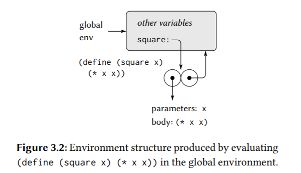
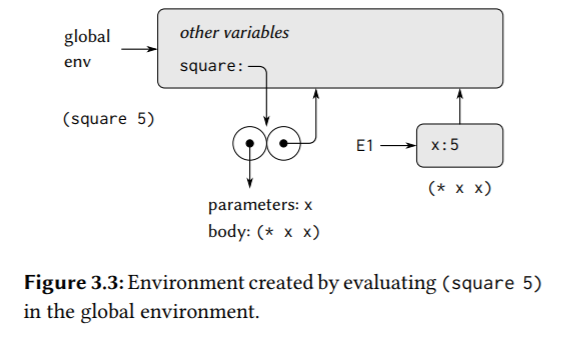
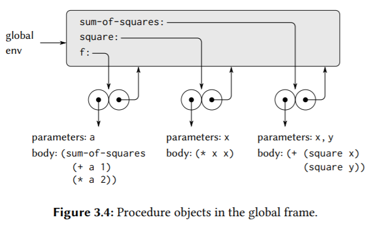
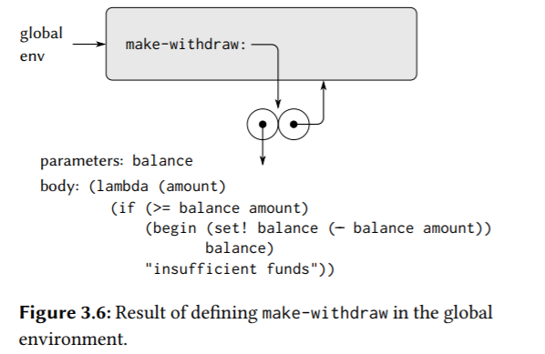
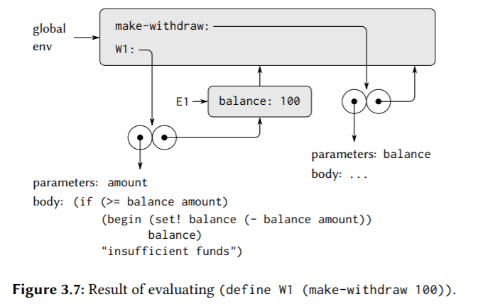
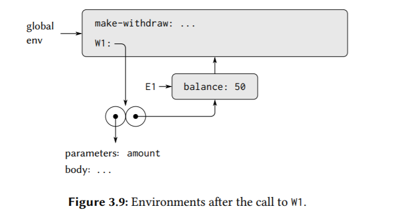
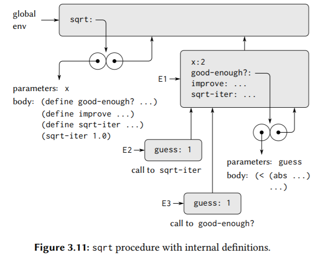

## 3.2 The Environment Model of Evaluation

### 3.2.1 The Rules for Evaluation

the presence of assignment, a variable can no longer be considered to be merely a name for a value. Rather, **a variable must somehow designate a “place” in which values can be stored.** In our new model of evaluation, these places will be maintained in structures called environments.

**An environment is a sequence of frames. Each frame is a table (possibly empty) of bindings**, which associate variable names with their corresponding values. (A single frame may contain at most one binding for any variable.) Each frame also has a pointer to its enclosing environment, unless, for the purposes of discussion, the frame is considered to be global. **The value of a variable with respect to an environment is the value given by the binding of the variable in the first frame in the environment that contains a binding for that variable.** If no frame in the sequence specifies a binding for the variable, then the variable is said to be unbound in the environment.

**The environment is crucial to the evaluation process, because it determines the context in which an expression should be evaluated. an expression acquires a meaning only with respect to some environment in which it is evaluated.**

The environment model of procedure application can be summarized by two rules:

- **A procedure is created by evaluating a λ-expression relative to a given environment. The resulting procedure object（一个可调用对象） is a pair consisting of the text of the λ-expression and a pointer to the environment in which the procedure was created.**
  

- **A procedure object is applied to a set of arguments by constructing a frame, binding the formal parameters of the procedure to the arguments of the call, and then evaluating the body of the procedure in the context of the new environment constructed.** The new frame has (as its enclosing environment) (the environment part of the procedure object being applied).（倒装句式？）
  

We also specify that defining a symbol using define creates a binding in the current environment frame and assigns to the symbol the indicated value. Finally, we specify the behavior of set!, the operation that forced us to introduce the environment model in the first place. Evaluating the expression `(set! <variable> <value>)` in some environment **locates the binding of the variable in the environment and changes that binding to indicate the new value.** That is, one finds the first frame in the environment that contains a binding for the variable and modifies that frame. If the variable is unbound in the environment, then set! signals an error.

### 3.2.2 Applying Simple Procedures

> Exercise 3.9:

http://community.schemewiki.org/?sicp-ex-3.9

### 3.2.3 Frames as the Repository of Local State

Exercise 3.10:
http://community.schemewiki.org/?sicp-ex-3.10

### 3.2.4 Internal Definitions

这就是为什么内部定义的过程可以使用外部过程的变量，如形参，因为内部过程在外部过程调用构造的frameA中被求值，创建实体对象，这些对象的第二个部分指向该frameA，当它们被调用时，它们会**创建自己的frame，指向frameA**，可以通过往上查找找到在frameA中的变量。

The environment model thus explains the two key properties that make local procedure definitions a useful technique for modularizing programs:
- **The names of the local procedures do not interfere with names external to the enclosing procedure, because the local procedure names will be bound in the frame that the procedure creates when it is run, rather than being bound in the global environment.**
- The local procedures can access the arguments of the enclosing procedure, simply by using parameter names **as free variables**（对于内部过程来说是自由变量）. This is because the body of the local procedure is evaluated in an environment that is subordinate to the evaluation environment for the enclosing procedure.

> Exercise 3.11:

http://community.schemewiki.org/?sicp-ex-3.11

python的环境模型似乎和这个几乎是一样的。

有一点是，python中对自由变量赋值需要一个nonlocal声明，否则python会创建一个局部变量绑定到赋值表达式的值。而在scheme中，set!则没有这个问题，set!和赋值操作符类似，改变一个变量指向新的值/对象，但是set!要求改变的变量必须在环境中已被定义且能够找到，否则就会发出错误。

