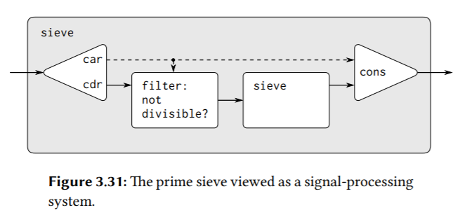
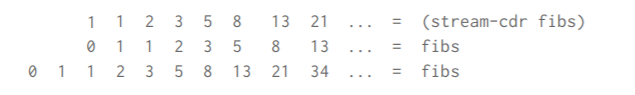

## 3.5 Streams

Let’s step back and review where this complexity comes from. In an attempt to model real-world phenomena, we made some apparently reasonable decisions: We modeled real-world objects with local state by computational objects with local variables. We identified time variation in the real world with time variation in the computer. We implemented the time variation of the states of the model objects in the computer with assignments to the local variables of the model objects.

Is there another approach? Can we avoid identifying time in the computer with time in the modeled world? Must we make the model change with time in order to model phenomena in a changing world? Think about the issue in terms of mathematical functions. We can describe the time-varying behavior of a quantity x as a function of time x(t). If we concentrate on x instant by instant, we think of it as a changing quantity. Yet if we concentrate on the entire time history of values, we do not emphasize change—the function itself does not change.

If time is measured in discrete steps, then we can model a time function as a (possibly infinite) sequence. In this section, we will see how to model change in terms of sequences that represent the time histories of the systems being modeled.

```scheme
(define (sum-primes a b)
  (define (iter count accum)
    (cond ((> count b) accum)
          ((prime? count)
           (iter (+ count 1) (+ count accum)))
          (else (iter (+ count 1) accum))))
  (iter a 0))

(define (sum-primes a b)
  (accumulate +
              0
              (filter prime?
                      (enumerate-interval a b))))
```

比较两个版本的sum-primes，前者只需要O(1)的内存开销，后者的实现非常间接优雅，但是它的内存开销也非常大，而且，看一下下面这个表达式，它意在求解出从10000开始的第二个质数，然而在enumerate-interval求值完成之前，filter无法做任何事，且在filter求值完成之前，cdr无法被求值，这就导致，我们仅仅只是想要求解第二个质数，但是这个表达式却做了大量无意义的计算并消耗了线性内存空间。

```scheme
(car (cdr (filter prime?
                  (enumerate-interval 10000 1000000))))
```

With streams we can achieve the best of both worlds: We can formulate programs elegantly as sequence manipulations, while attaining the efficiency of incremental computation.

其实如果不提前结束的话，最终的存储开销应该是一样的？只不过，stream的惰性求值可以让我们根据需要提前结束，而又不需要再产出用不到的数据，list是做不到这点的。另外stream的惰性求值使得各种序列操作之间可以交替进行，这会导致stream的响应时间快一点？（比如对于上面的表达式，如果改为要求出区间内所有的质数，那么使用list的版本需要等待一段时间后一次性产出结果，而使用stream的版本可以很快产出第一个，然后第二个，……，注意这里说的是响应时间，并不是说整个计算完成的时间）

cons-stream是一个special form，`(cons-stream <a> <b>)`等价于`(cons <a> (delay <b>))`。也就是，实现上，stream是一个pair，car指向已计算过/求值过的元素，cdr指向一个promise。当请求car时，简单地返回car指针，当请求cdr时，即时对promise求值，产生又一个pair，同样，它的car指向已计算过/求值过的元素，cdr指向又一个promise，然后cdr操作会返回指向这个pair的指针。

注意，stream不是list，也不是一个连一个的pair，它**只是就一个pair**。（虽然对象存储上，该pair前面可能有其它被消耗过的pair指向该pair）另外注意，pair的car指向的已求值过的元素往往是单例的，变的（如创建）往往只是pair本身。

```scheme
(define p (delay (+ 2 3)))
p ; #<promise>
; (p) ; not a procedure;
(force p) ; 5
```

以下是selector的实现：

```scheme
(define (stream-car stream) (car stream))
(define (stream-cdr stream) (force (cdr stream)))
```

上面的表达式改为使用stream，如下：

```scheme
(stream-car
 (stream-cdr
  (stream-filter prime?
                 (stream-enumerate-interval
                  10000 1000000))))
```

#### Implementing delay and force

```scheme
; (delay ⟨exp⟩) ; 对该表达式求值返回一个promise。
; (lambda () ⟨exp⟩) ; 对该表达式求值返回一个，返回一个callable，求值该callable才求值exp。
(define (force delayed-object) (delayed-object))

; 优化delay。
(define (memo-proc proc)
  (let ((already-run? false) (result false))
    (lambda ()
      (if (not already-run?)
          (begin (set! result (proc))
                 (set! already-run? true)
                 result)
          result))))
; (memo-proc (lambda () <exp>))
```

```scheme
; Exercise 3.50:
(define (stream-map proc . argstreams)
  (if (stream-null? (car argstreams)) ; 这里用car，因为可变参数列表就是一个list，其中每个pair的car指向一个参数，这里是指向一个stream。
      the-empty-stream
      (cons-stream
       (apply proc (map stream-car argstreams))
       (apply stream-map
              (cons proc (map stream-cdr argstreams))))))

; (apply proc (map (lambda (argstream) (stream-car argstream)) argstreams)) ; 无需这么写，因为它们都接收一个参数，且函数体无需任何别的处理。


; Exercise 3.51:
(define (stream-ref stream n)
  (if (= n 0)
      (stream-car stream)
      (stream-ref (stream-cdr stream) (- n 1))))

(define (display-line x) (display x) (newline))

(define (show x)
  (display-line x)
  x) ; show除了打印，相当于一个identity。

; x是一个stream。
; 对该表达式求值会打印0。
(define x
  (stream-map show
              (stream-enumerate-interval 0 10)))

x ; (0 . #<promise>)

(stream-ref x 5) ; 打印1-5，并返回5。
(stream-ref x 7) ; 打印6, 7，并返回7。

; Exercise 3.52:
(define (display-stream s)
  (stream-for-each display-line s))
(define (stream-for-each proc s)
  (if (stream-null? s)
      'done
      (begin (proc (stream-car s))
             (stream-for-each proc (stream-cdr s)))))

(define sum 0)
(define (accum x) (set! sum (+ x sum)) sum) ; 注意这里返回的是sum而不是x。
; seq = [1, 3, 6, 10, 15, 21, 28, 36, 45, 55, 66, 78, 91, 105, 120, 136, 153, ...]
(define seq
  (stream-map accum
              (stream-enumerate-interval 1 20)))
seq ; (1 . #<promise>)
sum ; 1

; y = [6, 10, 28, 36, 66, 78, 120, 136, ...]
(define y (stream-filter even? seq))
y ; (6 . #<promise>)
sum ; 6

(define z
  (stream-filter (lambda (x) (= (remainder x 5) 0))
                 seq))
z ; (10 . #<promise>)
sum ; 10
(stream-ref y 7) ; 136，下标从1开始。
sum ; 136
(display-stream z) ; 打印z，返回done。
sum ; 210

; 可以看到，上面反复对seq的各个promise求值，如果没有缓存计算结果，在这里是指向新pair的指针的话，就重复计算了。
```

### 3.5.2 Infinite Streams

```scheme
(define (integers-starting-from n)
  (cons-stream n (integers-starting-from (+ n 1)))) ; 没有边界/终止条件。
(define integers (integers-starting-from 1))

(define (divisible? x y) (= (remainder x y) 0))
(define no-sevens
  (stream-filter (lambda (x) (not (divisible? x 7)))
                 integers))
(stream-ref no-sevens 100) ; 117

; sieve of Eratosthenes. We start with the integers beginning with 2,
; which is the first prime. To get the rest of the primes,
; we start by filtering the multiples of 2 from the rest of the integers.
; This leaves a stream beginning with 3, which is the next prime.
; Now we filter the multiples of 3 from the rest of this stream.
; This leaves a stream beginning with 5, which is the next prime, and so on.
(define (sieve stream)
  (cons-stream
   (stream-car stream)
   (sieve (stream-filter
           (lambda (x)
             (not (divisible? x (stream-car stream))))
           (stream-cdr stream)))))
(define primes (sieve (integers-starting-from 2)))

(stream-ref primes 50) ; 233
```



```scheme
(define ones (cons-stream 1 ones))

(define (add-streams s1 s2) (stream-map + s1 s2))

(define integers
  (cons-stream 1 (add-streams ones integers)))
  
(define fibs
  (cons-stream
   0
   (cons-stream 1 (add-streams (stream-cdr fibs) fibs))))
```



> Exercise 3.53: Without running the program, describe the elements of the stream defined by
> `(define s (cons-stream 1 (add-streams s s)))`

参照上面这幅图，它产生2的幂。

```scheme
; Exercise 3.54:
(define (mul-streams s1 s2)
  (stream-map * s1 s2))
(define factorials
  (cons-stream 1 (mul-streams (integers-starting-from 2) factorials)))

(stream-ref factorials 2) ; 3!=6
(stream-ref factorials 3) ; 4!=24
(stream-ref factorials 4) ; 5!=120
```

